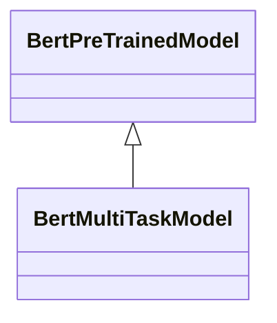
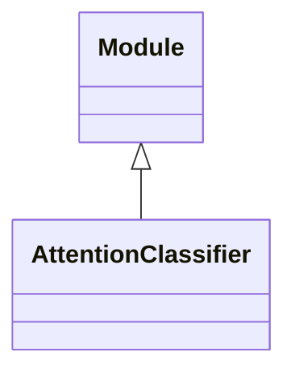
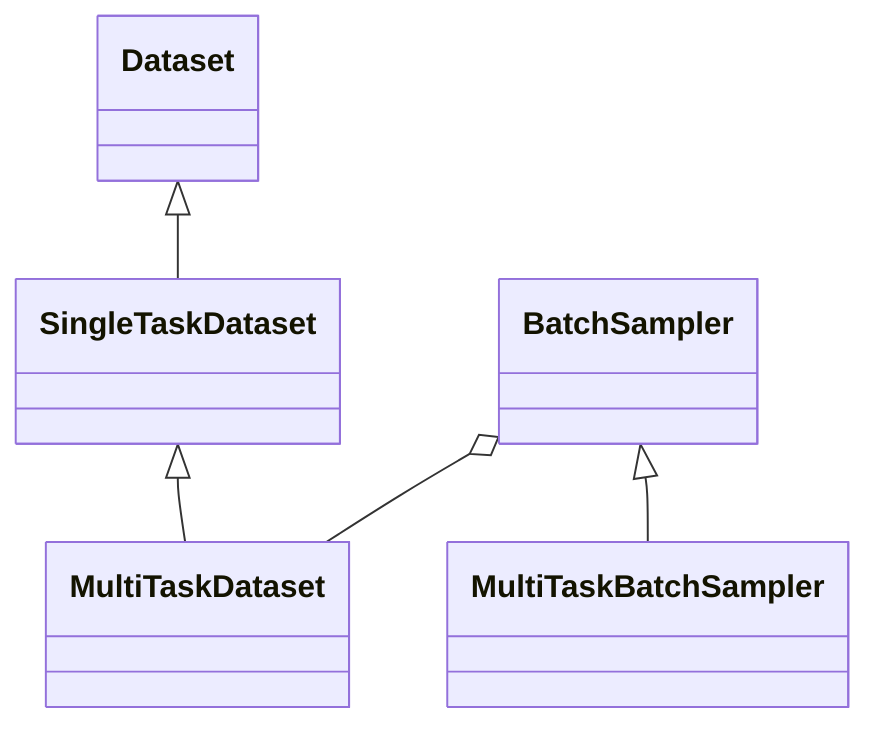
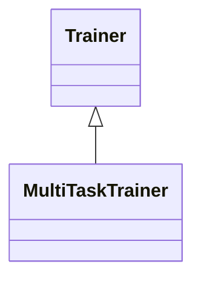
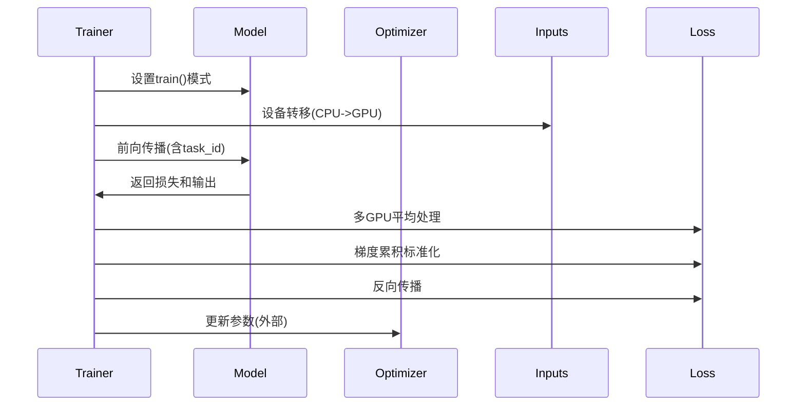
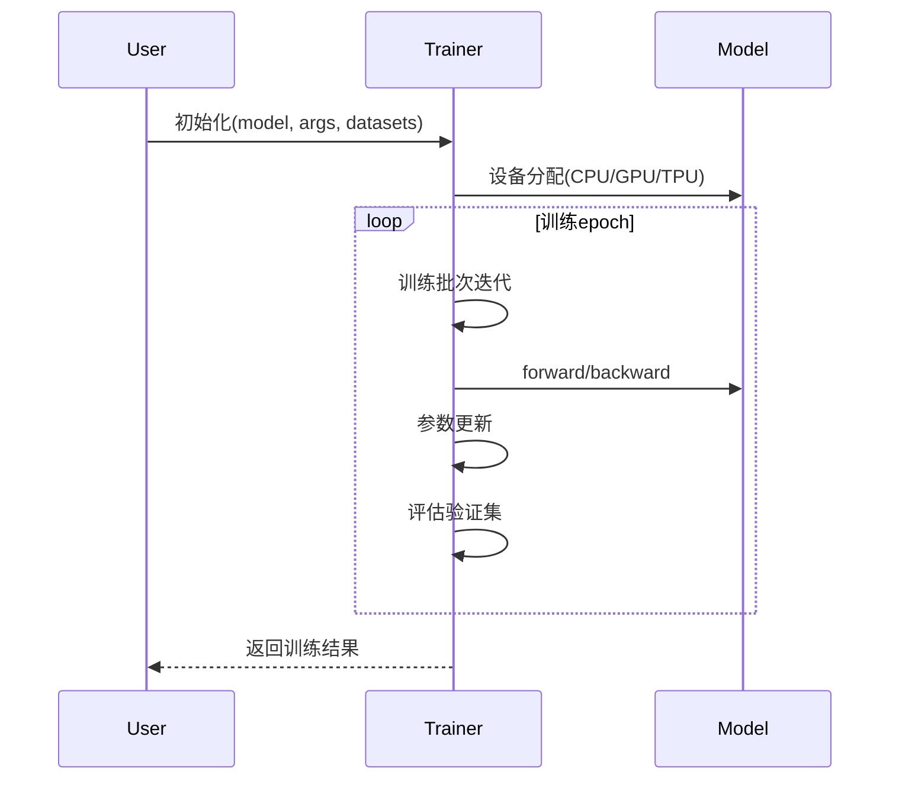
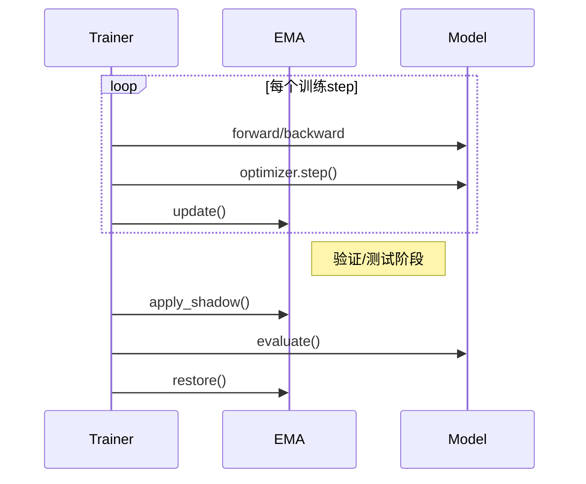
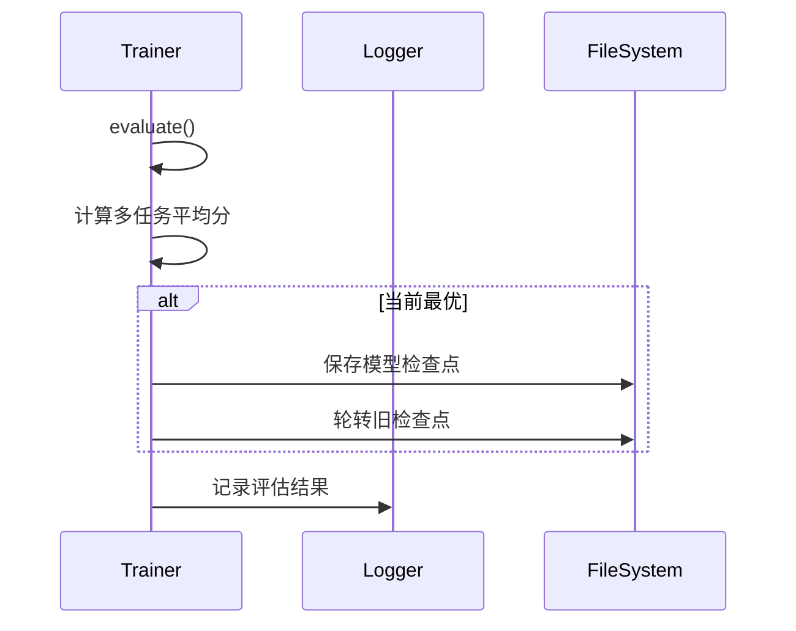

# Baseline源码阅读分析

## 1、背景

阅读Baseline源码，熟悉源码设计和代码流程，熟悉数据预处理、模型设计，模型训练以及模型测试，便于设计自己的模型；

源码链接：https://github.com/HuipengXu/tianchi-multi-task?spm=a2c22.12281976.0.0.487a20a9Nx0rCP、

## 2、源码软件设计分析

阅读源码软件总体架构分为：

**1、数据预处理模块**，单独的一个处理程序preprocess.py，包含nli数据清理和emotion数据处理以及去重处理功能，主要处理nli和emotion训练数据中的特殊字符；

**2、BERT多任务模型BertMultiTaskModel**，包含预训练的Bert，Dropout，多个任务基于注意力分类器AttentionClassifier，前向传播从输入数据到BERT，再经过dropout，输出到多任务分类器，使用交叉熵损失；

- **注意力分类器AttentionClassifier**：包含注意力模块Attention和全连接层FNN，前向传播经过注意力模块，在经过全连接层输出；

**3、训练模块train.py**，主要组成如下：

- **参数解析模块**，自定义ModelArguments模型参数数据类，DataTrainingArguments数据训练参数数据类，以及使用HFL模型训练参数TrainingArguments；
- **数据集处理模块**，自定义多任务数据集MultiTaskDataset，包含多个自定义单任务书记SingleTaskDataset，加载数据集，获取索引，返回长度；
- **加载预训练模型**，调用BertMultiTaskModel.from_pretrained，使用hfl/chinese-roberta-wwm-ext-large预训练模型和词表，它是一个中文预训练语言模型，它是基于 **RoBERTa** 架构，并使用了 **Whole Word Masking（全词掩码）** 技术，在大规模中文语料上进行了预训练，且是 **large** 版本（即参数规模较大）。
- **模型训练模块MultiTaskTrainer**，提供获取训练、测试、评估Dataloader以及训练步骤，包含多任务批数据采样MultiTaskBatchSampler，训练是调用自定义EMA优化； MultiTaskTrainer继承Trainer，Trainer提供获取dataloader、获取优化器、模型训练、评估预测等接口；

总体软件设计逻辑视图如下图所示：


## 3、源码模块分析

### 3.1 数据预处理模块

源码提供了一个单独脚本preprocess.py处理赛题提供的训练、评估、测试数据；

数据集天池链接：https://tianchi.aliyun.com/dataset/133838

数据集文件如下：

```
|-- nlp_round1_data
|   |-- OCEMOTION_a.csv
|   |-- OCEMOTION_train1128.csv
|   |-- OCNLI_a.csv
|   |-- OCNLI_train1128.csv
|   |-- TNEWS_a.csv
|   |-- TNEWS_train1128.csv
|   `-- download.sh
`-- nlp_round2_data
    |-- download.sh
    |-- ocemotion_test_B.csv
    |-- ocnli_test_B.csv
    `-- tnews_test_B.csv
```

OCNLI：是第一个非翻译的、使用原生汉语的大型中文自然语言推理数据集；

OCEMOTION：是包含7个分类的细粒度情感性分析数据集；

 TNEWS：来源于今日头条的新闻版块，共包含15个类别的新闻；

TNEWS：

- TNEWS_train1128.csv: TNEWS训练集，63,360条记录
- TNEWS_a.csv: TNEWS初赛测试集，1,500条记录
- TNEWS_b.csv: TNEWS复赛测试集，1,500条记录

OCNLI:

- OCNLI_train1128.csv: OCNLI训练集，53,387条记录
- OCNLI_a.csv: OCNLI初赛测试集，1,500条记录
- OCNLI_b.csv: OCNLI复赛测试集，1,500条记录

OCEMOTION：

- OCEMOTION_train1128.csv: OCEMOTION训练集，35,694条记录
- OCEMOTION_a.csv: OCEMOTION初赛测试集，1,500条记录
- OCEMOTION_b.csv: OCEMOTION初赛测试集，1,500条记录

基线代码对OCNLI和OCEMOTION进行了处理，TNEWS直接拷贝到user_data目录下；

user_data目录：

```
|-- cleaned_nlp_round1_data
|   |-- OCEMOTION_a.csv
|   |-- OCEMOTION_train1128.csv
|   |-- OCNLI_a.csv
|   |-- OCNLI_train1128.csv
|   |-- TNEWS_a.csv
|   `-- TNEWS_train1128.csv
|-- cleaned_nlp_round2_data
|   |-- OCEMOTION_train1128.csv
|   |-- OCNLI_train1128.csv
|   |-- TNEWS_train1128.csv
|   |-- ocemotion_test_B.csv
|   |-- ocnli_test_B.csv
|   `-- tnews_test_B.csv
`-- emoji2zh.json
```


#### 3.1.1 nli数据清理（无效代码）

nli训练数据格式:

```
# id\t句子1\t句子2\t标签
0 一月份跟二月份肯定有一个月份有.	肯定有一个月份有	0  
1 一月份跟二月份肯定有一个月份有.	一月份有	1  
2 一月份跟二月份肯定有一个月份有.	一月二月都没有	2  

标签含义
0: 蕴含
1: 中性
2: 不相关Plain Text
```

源码读取tcdata目录下数据，然后按行读取，按照\t分割读取到字典中，然后转到df中，输出user_data到csv，无效代码。

```python
def clean_nli(data_path, save_dir, train=True):
    data = defaultdict(list)
    filename = os.path.basename(data_path)
    with open(data_path, 'r', encoding='utf8') as f:
        texts = f.readlines()
        for line in tqdm(texts, desc=data_path):
            if train:
                id_, text_a, text_b, label = line.strip().split('\t')
            else:
                id_, text_a, text_b = line.strip().split('\t')
            data['id'].append(id_)
            data['premise'].append(text_a)
            data['hypothesis'].append(text_b)
            if train:
                data['label'].append(label)
    df = pd.DataFrame(data)
    print("clean_nli: ", df)
    if not os.path.exists(save_dir):
        os.makedirs(save_dir)
    df.to_csv(os.path.join(save_dir, filename), index=False,
              encoding='utf8', header=False, sep='\t')
    return df
```

#### 3.1.2 emotion数据处理

emotion训练数据格式:

```
# id\t句子\t标签
0 你知道多伦多附近有什么吗?哈哈有破布耶...真的书上写的你听哦...你家那块破布是世界上最大的破布,哈哈,骗你的啦它是说尼加拉瓜瀑布是世界上最大的瀑布啦...哈哈哈''爸爸,她的头发耶!我们大扫除椅子都要翻上来我看到木头缝里有头发...一定是xx以前夹到的,你说是不是?[生病] sadness  
1 平安夜,圣诞节,都过了,我很难过,和妈妈吵了两天,以死相逼才终止战争,现在还处于冷战中。sadness  
2 我只是自私了一点,做自己想做的事情! sadness  
3 让感动的不仅仅是雨过天晴,还有泪水流下来的迷人眼神。happiness  
4 好日子 happiness  
```

源码分析：

1、按行读取数据,\t分割；

2、对文本中表情替换为中文，使用emoji2zh.json替换；

3、对文本符号进行去重处理；

4、使用pd写入到user_data目录下；

```python
def clean_emotion(data_path, emoji2zh_data, save_dir, train=True):
    data = defaultdict(list)
    filename = os.path.basename(data_path)
    with open(data_path, 'r', encoding='utf8') as f:
        texts = f.readlines()
        for line in tqdm(texts, desc=data_path):
            if train:
                id_, text, label = line.strip().split('\t')
            else:
                id_, text = line.strip().split('\t')
            data['id'].append(id_)
            text = emoji2zh(text, emoji2zh_data)
            text = clean_duplication(text)
            data['text'].append(text)
            if train:
                data['label'].append(label)
    df = pd.DataFrame(data)
    if not os.path.exists(save_dir):
        os.makedirs(save_dir)
    df.to_csv(os.path.join(save_dir, filename), index=False,
              encoding='utf8', header=False, sep='\t')
    return df

def emoji2zh(text, inverse_emoji_dict):
    for emoji, ch in inverse_emoji_dict.items():
        text = text.replace(emoji, ch)
    return text

def clean_duplication(text):
    left_square_brackets_pat = re.compile(r'\[+')
    right_square_brackets_pat = re.compile(r'\]+')
    punct = [',', '\\.', '\\!', '，', '。', '！', '、', '\?', '？']

    def replace(string, char):
        pattern = char + '{2,}'
        if char.startswith('\\'):
            char = char[1:]
        string = re.sub(pattern, char, string)
        return string

    text = left_square_brackets_pat.sub('', text)
    text = right_square_brackets_pat.sub('', text)
    for p in punct:
        text = replace(text, p)
    return text
```

输入文本：

```
'你知道多伦多附近有什么吗?哈哈有破布耶...真的书上写的你听哦...你家那块破布是世界上最大的破布,哈哈,骗你的啦它是说尼加拉瓜瀑布是世界上最大的瀑布啦...哈哈哈''爸爸,她的头发耶!我们大扫除椅子都要翻上来我看到木头缝里有头发...一定是xx以前夹到的,你说是不是?[生病]

```

输出文本:

```
'你知道多伦多附近有什么吗?哈哈有破布耶.真的书上写的你听哦.你家那块破布是世界上最大的破布,哈哈,骗你的啦它是说尼加拉瓜瀑布是世界上最大的瀑布啦.哈哈哈''爸爸,她的头发耶!我们大扫除椅子都要翻上来我看到木头缝里有头发.一定是xx以前夹到的,你说是不是?生病
```

#### 3.1.3 bert输入数据预处理

preprocess核心源码：

```python
def preprocess(args: Any, task: str, test_b: bool = False):
    print("DEBUG preprocess args: ", args)
    print("DEBUG preprocess task: ", task)
    print("DEBUG preprocess test_b", test_b)
    data_name = task_data[task]
    if test_b:
        print('Inference stage ...')
        data_name['predict'] = data_name['test_b']
    train_df = get_df(args.data_dir, data_name['train'])
    pred_df = get_df(args.data_dir, data_name['predict'])
    
    print("DEBUG preprocess train_df", train_df.shape, train_df[:3])
    print("DEBUG preprocess pred_df", pred_df.shape, pred_df[:3])

    pretrained_model_path = args.tokenizer_dir
    tokenizer = BertTokenizer.from_pretrained(pretrained_model_path)
    train_precessed, val_precessed, label2id = convert_df_to_inputs(task, tokenizer, train_df,
                                                                    args.train_val_split_ratio, debug=args.data_debug)
    predict_precessed, = convert_df_to_inputs(task, tokenizer, pred_df, label2id=label2id, debug=args.data_debug)

    print("DEBUG preprocess tokenizer: ", tokenizer)
    print("DEBUG preprocess train_precessed, val_precessed, label2id: ", train_precessed, val_precessed, label2id)
    print("DEBUG preprocess predict_precessed: ", predict_precessed)


    data_save_dir = os.path.join(args.data_save_dir, task)
    if not os.path.exists(data_save_dir):
        os.makedirs(data_save_dir)

    print(f'Saving processed {task} data ...')
    cache_data_path = {
        'train': os.path.join(args.data_save_dir, task, 'train.pt'),
        'val': os.path.join(args.data_save_dir, task, 'val.pt'),
        'predict': os.path.join(args.data_save_dir, task, 'predict.pt')
    }
    json.dump(label2id, open(os.path.join(data_save_dir, 'label2id.json'), 'w'))
    torch.save(train_precessed, cache_data_path['train'])
    torch.save(val_precessed, cache_data_path['val'])
    torch.save(predict_precessed, cache_data_path['predict'])

    return cache_data_path
```

测试输入：

```
DEBUG preprocess args:  DataTrainingArguments(tokenizer_dir='hfl/chinese-roberta-wwm-ext-large', data_dir='../user_data/cleaned_nlp_round1_data', data_save_dir='../user_data/nlp_round1_data_processed', task_name=None, max_seq_length=300, overwrite_cache=True, data_debug=False, pseudo=True, test_b=False, pad_to_max_length=True, train_val_split_ratio=0.1, train_file=None, validation_file=None)
DEBUG preprocess task:  ocnli
DEBUG preprocess test_b False
DEBUG preprocess train_df (53387, 4)    0                 1         2  3
0  0  一月份跟二月份肯定有一个月份有.  肯定有一个月份有  0
1  1  一月份跟二月份肯定有一个月份有.      一月份有  1
2  2  一月份跟二月份肯定有一个月份有.   一月二月都没有  2
DEBUG preprocess pred_df (1500, 3)    0                                  1               2
0  0                来回一趟象我们两个人要两千五百块美金.     我们有急事需要来回往返
1  1                     这个就被这门功课给卡下来了.         这门功课挂科了
2  2  王琦瑶有一种本领,她能够将日常生活变成一份礼物,使你一下子看见了它  王琦瑶对于生活的态度非常消极
convert_df_to_inputs label2id:  {'0': 0, '1': 1, '2': 2}
convert_df_to_inputs train:  True
convert_df_to_inputs label2id:  {'0': 0, '1': 1, '2': 2}
convert_df_to_inputs train:  False
DEBUG preprocess tokenizer:  BertTokenizer(name_or_path='hfl/chinese-roberta-wwm-ext-large', vocab_size=21128, model_max_length=1000000000000000019884624838656, is_fast=False, padding_side='right', truncation_side='right', special_tokens={'unk_token': '[UNK]', 'sep_token': '[SEP]', 'pad_token': '[PAD]', 'cls_token': '[CLS]', 'mask_token': '[MASK]'}, clean_up_tokenization_spaces=True, added_tokens_decoder={
	0: AddedToken("[PAD]", rstrip=False, lstrip=False, single_word=False, normalized=False, special=True),
	100: AddedToken("[UNK]", rstrip=False, lstrip=False, single_word=False, normalized=False, special=True),
	101: AddedToken("[CLS]", rstrip=False, lstrip=False, single_word=False, normalized=False, special=True),
	102: AddedToken("[SEP]", rstrip=False, lstrip=False, single_word=False, normalized=False, special=True),
	103: AddedToken("[MASK]", rstrip=False, lstrip=False, single_word=False, normalized=False, special=True),
}
)
DEBUG preprocess train_precessed, val_precessed, label2id:  dict_keys(['input_ids', 'token_type_ids', 'attention_mask', 'targets']) dict_keys(['input_ids', 'token_type_ids', 'attention_mask', 'targets']) {'0': 0, '1': 1, '2': 2}
DEBUG preprocess predict_precessed:  dict_keys(['input_ids', 'token_type_ids', 'attention_mask', 'targets'])
Saving processed ocnli data ...  
DEBUG preprocess label2id:  {'0': 0, '1': 1, '2': 2}
DEBUG preprocess train_precessed:  dict_keys(['input_ids', 'token_type_ids', 'attention_mask', 'targets'])
DEBUG preprocess val_precessed:  dict_keys(['input_ids', 'token_type_ids', 'attention_mask', 'targets'])
DEBUG preprocess predict_precessed:  dict_keys(['input_ids', 'token_type_ids', 'attention_mask', 'targets'])

```


**convert_df_to_inputs函数：**

```python
def convert_df_to_inputs(task: str, tokenizer: BertTokenizer, df: pd.DataFrame,
                         train_val_split_ratio: Optional[float] = None,
                         label2id: Optional[dict] = None, debug: bool = False) -> tuple:
    print("convert_df_to_inputs task: ", task)
    print("convert_df_to_inputs tokenizer: ", tokenizer)
    print("convert_df_to_inputs df: ", df)
    print("convert_df_to_inputs train_val_split_ratio: ", train_val_split_ratio)
    print("convert_df_to_inputs label2id: ", label2id)
    print("convert_df_to_inputs debug: ", debug)
    inputs = defaultdict(list)
    train = False
    if debug:
        df = df.head(1000)
    df.sample(frac=1, replace=True, random_state=32)
    label2id, train = _iter_row(df, inputs, task, tokenizer, train, train_val_split_ratio, label2id)

    print("convert_df_to_inputs label2id: ", label2id)
    print("convert_df_to_inputs train: ", train)

    if train_val_split_ratio is not None:
        outputs = train_val_split(inputs, train_val_split_ratio)
    else:
        outputs = (inputs,)

    if train:
        outputs += (label2id,)

    print("convert_df_to_inputs outputs: ", outputs)
    return outputs
```

测试：

```python
convert_df_to_inputs task:  ocnli
convert_df_to_inputs tokenizer:  BertTokenizer(name_or_path='hfl/chinese-roberta-wwm-ext-large', vocab_size=21128, model_max_length=1000000000000000019884624838656, is_fast=False, padding_side='right', truncation_side='right', special_tokens={'unk_token': '[UNK]', 'sep_token': '[SEP]', 'pad_token': '[PAD]', 'cls_token': '[CLS]', 'mask_token': '[MASK]'}, clean_up_tokenization_spaces=True, added_tokens_decoder={
	0: AddedToken("[PAD]", rstrip=False, lstrip=False, single_word=False, normalized=False, special=True),
	100: AddedToken("[UNK]", rstrip=False, lstrip=False, single_word=False, normalized=False, special=True),
	101: AddedToken("[CLS]", rstrip=False, lstrip=False, single_word=False, normalized=False, special=True),
	102: AddedToken("[SEP]", rstrip=False, lstrip=False, single_word=False, normalized=False, special=True),
	103: AddedToken("[MASK]", rstrip=False, lstrip=False, single_word=False, normalized=False, special=True),
}
)
convert_df_to_inputs df:             0  ...  3
0          0  ...  0
1          1  ...  1
2          2  ...  2
3          3  ...  0
4          4  ...  0
...      ...  ... ..
53382  53382  ...  2
53383  53383  ...  0
53384  53384  ...  0
53385  53385  ...  0
53386  53386  ...  0

[53387 rows x 4 columns]
convert_df_to_inputs train_val_split_ratio:  0.1
convert_df_to_inputs label2id:  None
convert_df_to_inputs debug:  False
convert_label_to_id targets_series:  0        0
1        1
2        2
3        0
4        0
        ..
53382    2
53383    0
53384    0
53385    0
53386    0
Length: 53387, dtype: int64
convert_label_to_id label2id:  None
convert_label_to_id label2id:  {'0': 0, '1': 1, '2': 2}
convert_label_to_id targets_series:  0        0
1        1
2        2
3        0
4        0
        ..
53382    2
53383    0
53384    0
53385    0
53386    0
Length: 53387, dtype: object
convert_label_to_id targets_series:  0        0
1        1
2        2
3        0
4        0
        ..
53382    2
53383    0
53384    0
53385    0
53386    0
Length: 53387, dtype: int64
convert_label_to_id targets:  tensor([0, 1, 2,  ..., 0, 0, 0])
convert_label_to_id train:  True
convert_label_to_id outputs:  (tensor([0, 1, 2,  ..., 0, 0, 0]), {'0': 0, '1': 1, '2': 2})
convert_df_to_inputs label2id:  {'0': 0, '1': 1, '2': 2}
convert_df_to_inputs train:  True

convert_df_to_inputs outputs:  ({'input_ids': [[101, 2769, 4692, 6821,
```


**_iter_row 源码：**

```
def _iter_row(df, inputs: dict, task: str, tokenizer: BertTokenizer, train: bool,
              train_val_split_ratio: float, label2id: Optional[dict] = None) -> Tuple[dict, bool]:
    print("_iter_row df: ", df)
    print("_iter_row task: ", task)
    print("_iter_row tokenizer: ", tokenizer)
    print("_iter_row train: ", train)
    print("_iter_row train_val_split_ratio: ", train_val_split_ratio)
    print("_iter_row label2id: ", label2id)
    targets = []
    for _, row in tqdm(df.iterrows(), total=len(df), desc=f'Preprocess {task}'):
        print("_iter_row row: ", row)
        text_a = row[1]
        if task == 'ocnli':
            target_idx = 3
            text_b = row[2]
            output_ids = tokenizer.encode_plus(text_a, text_b, add_special_tokens=True,
                                               return_token_type_ids=True, return_attention_mask=True)
            print("_iter_row output_ids: ", output_ids)
        else:
            target_idx = 2
            output_ids = tokenizer.encode_plus(text_a, add_special_tokens=True,
                                               return_token_type_ids=True, return_attention_mask=True)
        inputs['input_ids'].append(output_ids['input_ids'])
        inputs['token_type_ids'].append(output_ids['token_type_ids'])
        inputs['attention_mask'].append(output_ids['attention_mask'])

        if train_val_split_ratio is not None:
            targets.append(row[target_idx])
        else:
            targets.append(list(label2id.keys())[0])
    targets_series = pd.Series(targets)
    if label2id is None:
        train = True
        targets, label2id = convert_label_to_id(targets_series)
    else:
        targets, = convert_label_to_id(targets_series, label2id)
    inputs['targets'] = targets
    print("_iter_row inputs: ", inputs)
    print("_iter_row label2id: ", label2id)
    print("_iter_row train: ", train)
    return label2id, train
```

输入参数, ocnli训练数据：

```
_iter_row df:             0  ...  3
0          0  ...  0
1          1  ...  1
2          2  ...  2
3          3  ...  0
4          4  ...  0
...      ...  ... ..
53382  53382  ...  2
53383  53383  ...  0
53384  53384  ...  0
53385  53385  ...  0
53386  53386  ...  0

[53387 rows x 4 columns]
_iter_row task:  ocnli
_iter_row tokenizer:  BertTokenizer(name_or_path='hfl/chinese-roberta-wwm-ext-large', vocab_size=21128, model_max_length=1000000000000000019884624838656, is_fast=False, padding_side='right', truncation_side='right', special_tokens={'unk_token': '[UNK]', 'sep_token': '[SEP]', 'pad_token': '[PAD]', 'cls_token': '[CLS]', 'mask_token': '[MASK]'}, clean_up_tokenization_spaces=True, added_tokens_decoder={
	0: AddedToken("[PAD]", rstrip=False, lstrip=False, single_word=False, normalized=False, special=True),
	100: AddedToken("[UNK]", rstrip=False, lstrip=False, single_word=False, normalized=False, special=True),
	101: AddedToken("[CLS]", rstrip=False, lstrip=False, single_word=False, normalized=False, special=True),
	102: AddedToken("[SEP]", rstrip=False, lstrip=False, single_word=False, normalized=False, special=True),
	103: AddedToken("[MASK]", rstrip=False, lstrip=False, single_word=False, normalized=False, special=True),
}
)
_iter_row train:  False
_iter_row train_val_split_ratio:  0.1
_iter_row label2id:  None
```

处理中间流程：

```python
_iter_row row:  0                   0
1    一月份跟二月份肯定有一个月份有.
2            肯定有一个月份有
3                   0
Name: 0, dtype: object
_iter_row output_ids:  {'input_ids': [101, 671, 3299, 819, 6656, 753, 3299, 819, 5507, 2137, 3300, 671, 702, 3299, 819, 3300, 119, 102, 5507, 2137, 3300, 671, 702, 3299, 819, 3300, 102], 'token_type_ids': [0, 0, 0, 0, 0, 0, 0, 0, 0, 0, 0, 0, 0, 0, 0, 0, 0, 0, 1, 1, 1, 1, 1, 1, 1, 1, 1], 'attention_mask': [1, 1, 1, 1, 1, 1, 1, 1, 1, 1, 1, 1, 1, 1, 1, 1, 1, 1, 1, 1, 1, 1, 1, 1, 1, 1, 1]}
_iter_row row:  0                   1
1    一月份跟二月份肯定有一个月份有.
2                一月份有
3                   1
Name: 1, dtype: object
_iter_row output_ids:  {'input_ids': [101, 671, 3299, 819, 6656, 753, 3299, 819, 5507, 2137, 3300, 671, 702, 3299, 819, 3300, 119, 102, 671, 3299, 819, 3300, 102], 'token_type_ids': [0, 0, 0, 0, 0, 0, 0, 0, 0, 0, 0, 0, 0, 0, 0, 0, 0, 0, 1, 1, 1, 1, 1], 'attention_mask': [1, 1, 1, 1, 1, 1, 1, 1, 1, 1, 1, 1, 1, 1, 1, 1, 1, 1, 1, 1, 1, 1, 1]}
_iter_row row:  0                   2
1    一月份跟二月份肯定有一个月份有.
2             一月二月都没有
3                   2
Name: 2, dtype: object
_iter_row output_ids:  {'input_ids': [101, 671, 3299, 819, 6656, 753, 3299, 819, 5507, 2137, 3300, 671, 702, 3299, 819, 3300, 119, 102, 671, 3299, 753, 3299, 6963, 3766, 3300, 102], 'token_type_ids': [0, 0, 0, 0, 0, 0, 0, 0, 0, 0, 0, 0, 0, 0, 0, 0, 0, 0, 1, 1, 1, 1, 1, 1, 1, 1], 'attention_mask': [1, 1, 1, 1, 1, 1, 1, 1, 1, 1, 1, 1, 1, 1, 1, 1, 1, 1, 1, 1, 1, 1, 1, 1, 1, 1]}
_iter_row row:  0               3
1    一点来钟时,张永红却来了
2      一点多钟,张永红来了
3               0
Name: 3, dtype: object
_iter_row output_ids:  {'input_ids': [101, 671, 4157, 3341, 7164, 3198, 117, 2476, 3719, 5273, 1316, 3341, 749, 102, 671, 4157, 1914, 7164, 117, 2476, 3719, 5273, 3341, 749, 102], 'token_type_ids': [0, 0, 0, 0, 0, 0, 0, 0, 0, 0, 0, 0, 0, 0, 1, 1, 1, 1, 1, 1, 1, 1, 1, 1, 1], 'attention_mask': [1, 1, 1, 1, 1, 1, 1, 1, 1, 1, 1, 1, 1, 1, 1, 1, 1, 1, 1, 1, 1, 1, 1, 1, 1]}
```

输出结果：

```
_iter_row label2id:  {'0': 0, '1': 1, '2': 2}
_iter_row train:  True
```


**convert_label_to_id 源码**

```
def convert_label_to_id(targets_series: pd.Series, label2id: Optional[dict] = None) -> tuple:
    print("convert_label_to_id targets_series: ", targets_series)
    print("convert_label_to_id label2id: ", label2id)
    labels = np.unique(targets_series.values)
    train = False
    if label2id is None:
        train = True
        label2id = {str(label): i for i, label in enumerate(labels)}
    print("convert_label_to_id label2id: ", label2id)
    targets_series = targets_series.apply(lambda label: str(label))
    print("convert_label_to_id targets_series: ", targets_series)
    targets_series = targets_series.apply(lambda label: label2id[label])
    print("convert_label_to_id targets_series: ", targets_series)
    targets = torch.from_numpy(targets_series.values.astype('int64'))
    print("convert_label_to_id targets: ", targets)
    outputs = (targets,)
    if train:
        outputs += (label2id,)
    print("convert_label_to_id train: ", train)
    print("convert_label_to_id outputs: ", outputs)
    return outputs
```


输入参数, ocnli训练数据：

```
convert_label_to_id targets_series:  0        0
1        1
2        2
3        0
4        0
        ..
53382    2
53383    0
53384    0
53385    0
53386    0
Length: 53387, dtype: int64
convert_label_to_id label2id:  None
convert_label_to_id label2id:  {'0': 0, '1': 1, '2': 2}
convert_label_to_id targets_series:  0        0
1        1
2        2
3        0
4        0
        ..
53382    2
53383    0
53384    0
53385    0
53386    0
Length: 53387, dtype: object
convert_label_to_id targets_series:  0        0
1        1
2        2
3        0
4        0
        ..
53382    2
53383    0
53384    0
53385    0
53386    0
Length: 53387, dtype: int64
convert_label_to_id targets:  tensor([0, 1, 2,  ..., 0, 0, 0])
convert_label_to_id train:  True
convert_label_to_id outputs:  (tensor([0, 1, 2,  ..., 0, 0, 0]), {'0': 0, '1': 1, '2': 2})
_
```


### 3.2 BERT多任务模型

定义BertMultiTaskModel类，继承BertPreTrainedModel，基于预训练的Bert进行微调，设计了一个基于注意力的分类器；

**总体结构：**


**类图设计：**



测试：

```python
BertMultiTaskModel task_num_classes:  {'0': 3, '1': 7, '2': 15}
BertMultiTaskModel model_path:  hfl/chinese-roberta-wwm-ext-large
BertMultiTaskModel self.bert BertModel(
  (embeddings): BertEmbeddings(
    (word_embeddings): Embedding(21128, 1024, padding_idx=0)
    (position_embeddings): Embedding(512, 1024)
    (token_type_embeddings): Embedding(2, 1024)
    (LayerNorm): LayerNorm((1024,), eps=1e-12, elementwise_affine=True)
    (dropout): Dropout(p=0.1, inplace=False)
  )
  (encoder): BertEncoder(
    (layer): ModuleList(
      (0-23): 24 x BertLayer(
        (attention): BertAttention(
          (self): BertSdpaSelfAttention(
            (query): Linear(in_features=1024, out_features=1024, bias=True)
            (key): Linear(in_features=1024, out_features=1024, bias=True)
            (value): Linear(in_features=1024, out_features=1024, bias=True)
            (dropout): Dropout(p=0.1, inplace=False)
          )
          (output): BertSelfOutput(
            (dense): Linear(in_features=1024, out_features=1024, bias=True)
            (LayerNorm): LayerNorm((1024,), eps=1e-12, elementwise_affine=True)
            (dropout): Dropout(p=0.1, inplace=False)
          )
        )
        (intermediate): BertIntermediate(
          (dense): Linear(in_features=1024, out_features=4096, bias=True)
          (intermediate_act_fn): GELUActivation()
        )
        (output): BertOutput(
          (dense): Linear(in_features=4096, out_features=1024, bias=True)
          (LayerNorm): LayerNorm((1024,), eps=1e-12, elementwise_affine=True)
          (dropout): Dropout(p=0.1, inplace=False)
        )
      )
    )
  )
  (pooler): BertPooler(
    (dense): Linear(in_features=1024, out_features=1024, bias=True)
    (activation): Tanh()
  )
)
BertMultiTaskModel self.dropout Dropout(p=0.1, inplace=False)
BertMultiTaskModel self.task_classifiers ModuleDict(
  (0): AttentionClassifier(
    (attn): Attention(
      (fc): Linear(in_features=1024, out_features=1, bias=False)
    )
    (fc): Linear(in_features=1024, out_features=3, bias=True)
  )
  (1): AttentionClassifier(
    (attn): Attention(
      (fc): Linear(in_features=1024, out_features=1, bias=False)
    )
    (fc): Linear(in_features=1024, out_features=7, bias=True)
  )
  (2): AttentionClassifier(
    (attn): Attention(
      (fc): Linear(in_features=1024, out_features=1, bias=False)
    )
    (fc): Linear(in_features=1024, out_features=15, bias=True)
  )
)
BertMultiTaskModel self.task_num_classes {'0': 3, '1': 7, '2': 15}
BertMultiTaskModel forward task_id:  0
BertMultiTaskModel forward input_ids:  torch.Size([16, 65])
BertMultiTaskModel forward token_type_ids:  torch.Size([16, 65])
BertMultiTaskModel forward attention_mask:  torch.Size([16, 65])
BertMultiTaskModel forward labels:  torch.Size([16])
BertMultiTaskModel forward outputs:  2 torch.Size([]) torch.Size([16, 3])

```


**构造函数：**

```python
def __init__(self, config: BertConfig, task_num_classes: dict, model_path: str):
        super(BertMultiTaskModel, self).__init__(config)

        self.bert = BertModel.from_pretrained(model_path, config=config)
        self.dropout = nn.Dropout(config.hidden_dropout_prob)
        self.task_classifiers = nn.ModuleDict({task_id: AttentionClassifier(config.hidden_size, num_classes)
                                               for task_id, num_classes in task_num_classes.items()})
        self.task_num_classes = task_num_classes
```

**nn.ModuleDict**

- **作用**：以字典形式管理多个子模块（类似 Python 的 `dict`），但会自动注册子模块的参数，支持 PyTorch 的参数优化和保存。
- 优势
  - 支持通过键（`task_id`）快速访问不同任务的分类器。
  - 自动处理子模块的 `state_dict`（模型参数）和梯度计算。

- **动态创建分类器**：为 `task_num_classes` 中的每个任务创建一个独立的 `AttentionClassifier`。
- 输入 `task_num_classes = {"task1": 2, "task2": 5}`，则生成：

```
{
    "task1": AttentionClassifier(hidden_size, 2),
    "task2": AttentionClassifier(hidden_size, 5)
}
```

**前向传播函数：**

```python
def forward(self,
            task_id: str,
            input_ids: torch.Tensor = None,
            token_type_ids: torch.Tensor = None,
            attention_mask: torch.Tensor = None,
            labels: torch.Tensor = None):
    mask = input_ids == 0
    outputs = self.bert(
        input_ids,
        attention_mask=attention_mask,
        token_type_ids=token_type_ids,
    )
    hidden_states = self.dropout(outputs[0])

    logits = self.task_classifiers[task_id](hidden_states, mask)

    outputs = (logits,)

    if labels is not None:
        loss_fct = nn.CrossEntropyLoss()
        loss = loss_fct(logits.view(-1, self.task_num_classes[task_id]), labels.view(-1))
        outputs = (loss,) + outputs

    return outputs
```

1. **任务特定分类器**：
   - 使用`nn.ModuleDict`管理不同任务的分类器
   - 每个任务有独立的线性分类层（`nn.Linear`）
2. **前向传播流程**：
   
   - 输入处理：创建padding mask（假设padding token_id为0）
   
   
   
   
   
   - Dropout：防止过拟合
   - 任务特定分类：根据`task_id`选择对应的分类器
3. **损失计算**：
   - 当提供`labels`时，计算交叉熵损失
   - 需要调整logits和labels的形状以匹配损失函数要求
4. **输出格式**：
   - 无labels时：返回(logits,)
   - 有labels时：返回(loss, logits)、

#### BertPreTrainedModel 介绍

`BertPreTrainedModel` 是 Hugging Face 的 `transformers` 库中定义的一个**基类**，专门用于加载和管理预训练的 BERT 模型（包括原始 BERT 及其变体，如 RoBERTa、ALBERT 等）。它是所有预训练 BERT 模型（如 `BertModel`、`BertForSequenceClassification` 等）的父类，提供了**模型加载、权重初始化、设备管理**等核心功能。

------

**1. 核心作用**

`BertPreTrainedModel` 的主要功能包括：

1. 预训练权重加载
   - 从本地或 Hugging Face Hub 下载并加载预训练模型的权重（如 `bert-base-uncased`）。
2. 模型初始化
   - 提供统一的初始化逻辑（如配置文件解析、参数注册）。
3. 设备管理
   - 支持将模型自动移动到 CPU/GPU（通过 `.to(device)`）。
4. 保存与加载
   - 提供 `save_pretrained()` 和 `from_pretrained()` 方法，方便模型持久化。
5. 基础方法
   - 实现通用的前向传播框架（子类需重写 `forward` 方法）。

------

2. **类继承关系**

```
PreTrainedModel (基类)
└── BertPreTrainedModel (BERT 专用基类)
    └── BertModel (基础 BERT 模型)
        └── BertForSequenceClassification (分类任务变体)
        └── BertForQuestionAnswering (问答任务变体)
    └── RoBERTaPreTrainedModel (RoBERTa 变体)
    └── ALBERTPreTrainedModel (ALBERT 变体)
```

- **`BertPreTrainedModel` 继承自 `PreTrainedModel`**，后者是所有 Transformer 模型的通用基类（支持 GPT、T5 等）。
- **BERT 及其变体（如 RoBERTa）的预训练模型均基于 `BertPreTrainedModel`**。

------

**3. 关键方法**

**(1) `from_pretrained()`**

- **作用**：从本地或远程加载预训练模型和配置。

- 参数：

  - `pretrained_model_name_or_path`：模型名称（如 `"bert-base-uncased"`）或本地路径。
  - `config`：可选的自定义配置对象。
  - `state_dict`：可选的自定义权重（用于部分加载）。

- 示例：

  ```
  from transformers import BertPreTrainedModel
  
  model = BertPreTrainedModel.from_pretrained("bert-base-uncased")
  ```

**(2) `save_pretrained()`**

- **作用**：将模型权重和配置保存到本地目录。

- 示例：

  ```
  model.save_pretrained("./my_model_directory")
  ```

**(3) `forward()`**

- **作用**：定义前向传播逻辑（**子类必须重写此方法**）。

- 示例 :`BertModel`的`forward`

  ```
  def forward(self, input_ids, attention_mask=None, ...):
      # 实现 BERT 的前向计算
      ...
  ```

**(4) `resize_token_embeddings()`**

- **作用**：动态调整词表大小（如新增特殊 token）。

- 示例：

  ```
  model.resize_token_embeddings(new_num_tokens=30522 + 10)  # 扩展词表
  ```

------

**4. 与 `BertModel` 的区别**

|       特性       |         `BertPreTrainedModel`          |            `BertModel`             |
| :--------------: | :------------------------------------: | :--------------------------------: |
|     **角色**     | 预训练模型的基类（加载/保存/设备管理） | 基础 BERT 架构实现（前向传播逻辑） |
| **是否可实例化** |         否（抽象类，需子类化）         |         是（可直接实例化）         |
|     **用途**     |       提供通用功能（如权重加载）       |        实现 BERT 的具体计算        |

- **`BertPreTrainedModel` 不能直接使用**，必须通过其子类（如 `BertModel`）实例化。

------

**5. 典型使用场景**

**(1) 加载预训练 BERT 并微调**

```
from transformers import BertForSequenceClassification

# 加载预训练模型（底层调用 BertPreTrainedModel.from_pretrained）
model = BertForSequenceClassification.from_pretrained("bert-base-uncased", num_labels=2)

# 微调代码...
```

**(2) 自定义 BERT 变体**

若需修改 BERT 架构（如添加新层），通常继承 `BertPreTrainedModel`：

```
from transformers import BertPreTrainedModel, BertModel

class CustomBert(BertPreTrainedModel):
    def __init__(self, config):
        super().__init__(config)
        self.bert = BertModel(config)  # 基础 BERT
        self.classifier = nn.Linear(config.hidden_size, 2)  # 自定义分类头

    def forward(self, input_ids, attention_mask):
        outputs = self.bert(input_ids, attention_mask)
        pooled_output = outputs.last_hidden_state[:, 0, :]  # [CLS] 向量
        logits = self.classifier(pooled_output)
        return logits

# 使用自定义模型
model = CustomBert.from_pretrained("bert-base-uncased")
```

------

6. **源码关键点**

- **文件位置**：Hugging Face `transformers` 库中的 `modeling_bert.py`。
- **核心逻辑：**
  - 在 `__init__` 中加载配置（`BertConfig`）。
  - 通过 `from_pretrained` 下载权重并初始化模型。
  - 提供 `register_buffer` 等方法管理缓冲区（如 `BatchNorm` 的 running stats）。

------

7. **总结**

- **`BertPreTrainedModel` 是 BERT 预训练模型的“骨架”**，负责加载、保存和设备管理。
- **实际使用时通常直接调用子类**（如 `BertModel`、`BertForSequenceClassification`）。
- **自定义模型时需继承它**，并实现自己的 `forward` 方法。

通过理解 `BertPreTrainedModel`，可以更灵活地扩展或修改 BERT 架构，适应特定任务需求。

#### 3.2.1 基于注意力分类器

总体结构就是一个注意力模块加一个N分类全连接，如下图所示：


类图设计




基于注意力分类器源码：

```python
class AttentionClassifier(nn.Module):
    def __init__(self, hidden_size: int, num_classes: int):
        super(AttentionClassifier, self).__init__()
        self.attn = Attention(hidden_size=hidden_size)
        self.fc = nn.Linear(hidden_size, num_classes)

    def forward(self, hidden_states: torch.Tensor, mask: torch.Tensor):
        h = self.attn(hidden_states, mask)
        out = self.fc(h)
        return out
```

注意力源码：

```python
class Attention(nn.Module):
    def __init__(self, hidden_size: int):
        super(Attention, self).__init__()
        self.fc = nn.Linear(hidden_size, 1, bias=False)

    def forward(self, hidden_state: torch.Tensor, mask: torch.Tensor):
        q = self.fc(hidden_state).squeeze(dim=-1)
        q = q.masked_fill(mask, -np.inf)
        w = F.softmax(q, dim=-1).unsqueeze(dim=1)
        h = w @ hidden_state
        return h.squeeze(dim=1)
```

1. **初始化部分**：
   - `hidden_size`：输入特征的维度
   - `nn.Linear(hidden_size, 1)`：单层全连接网络，用于计算注意力分数
2. **前向传播流程**：
   - **分数计算**：通过全连接层计算每个时间步的注意力分数
   - **Mask处理**：将padding位置的分数设为负无穷（softmax后权重为0）
   - **权重归一化**：使用softmax得到归一化的注意力权重
   - **加权求和**：用注意力权重对隐藏状态加权求和
3. **输入输出形状**：
   - 输入hidden_state：[batch_size, seq_len, hidden_size]
   - 输出：[batch_size, hidden_size]
4. **典型应用场景**：
   - 序列分类任务（如文本分类）
   - 需要关注关键token的任务（如问答系统）
   - 替代简单的pooling操作

### 3.3 训练模块

代码训练模块写的较为复杂，简单划分以下4个部分；

#### 3.3.1 参数解析模块

参数解析模块包含模型参数解析、数据训练参数解析，以及使用hfl库的TrainingArguments参数解析；

##### **3.3.1.1 ModelArguments模型参数解析源码**

```
@dataclass
class  ModelArguments:
    """
    Arguments pertaining to which model/config/tokenizer we are going to fine-tune from.
    """

    model_name_or_path: str = field(
        default='/root/paddlejob/workspace/train_data/datasets/data67127',
        metadata={"help": "Path to pretrained model or model identifier from huggingface.co/models"}
    )
    config_name: Optional[str] = field(
        default=None, metadata={"help": "Pretrained config name or path if not the same as model_name"}
    )
    tokenizer_name: Optional[str] = field(
        default=None, metadata={"help": "Pretrained tokenizer name or path if not the same as model_name"}
    )
    cache_dir: Optional[str] = field(
        default=None,
        metadata={"help": "Where do you want to store the pretrained models downloaded from huggingface.co"},
    )
    use_fast_tokenizer: bool = field(
        default=True,
        metadata={"help": "Whether to use one of the fast tokenizer (backed by the tokenizers library) or not."},
    )
    freeze: bool = field(
        default=False,
        metadata={"help": "Whether to bert model or not."},
    )

```

1. **数据类装饰器**：

   - `@dataclass`自动生成`__init__`等方法，简化类定义
   - 支持类型注解和默认值设置

2. **字段定义规范**：

   - 每个字段使用`field()`定义，包含：
     - `default`: 默认值
     - `metadata`: 参数的帮助信息（用于命令行解析）

3. **核心参数说明**：

   |        参数名        |     类型      |  默认值  |         用途          |
   | :------------------: | :-----------: | :------: | :-------------------: |
   | `model_name_or_path` |      str      | 指定路径 |    预训练模型位置     |
   |    `config_name`     | Optional[str] |   None   |   独立配置文件路径    |
   |   `tokenizer_name`   | Optional[str] |   None   |   独立tokenizer路径   |
   |     `cache_dir`      | Optional[str] |   None   |   下载模型缓存目录    |
   | `use_fast_tokenizer` |     bool      |   True   | 启用快速tokenizer实现 |
   |       `freeze`       |     bool      |  False   |   冻结基础模型参数    |

4. **设计优势**：

   - 与Hugging Face的`TrainingArguments`配合使用
   - 支持通过命令行参数覆盖默认值
   - 类型安全（通过`typing`模块）

##### **3.3.1.2 DataTrainingArguments数据训练参数解析源码分析**

```python
@dataclass
class DataTrainingArguments:
    """
    Arguments pertaining to what data we are going to input our model for training and eval.
    Using `HfArgumentParser` we can turn this class
    into argparse arguments to be able to specify them on
    the command line.
    """
    tokenizer_dir: Optional[str] = field(
        default='/root/paddlejob/workspace/train_data/datasets/data67127',
        metadata={"help": "raw data directory"},
    )
    data_dir: Optional[str] = field(
        default='/root/paddlejob/workspace/train_data/datasets/data67230',
        metadata={"help": "raw data directory"},
    )
    data_save_dir: Optional[str] = field(
        default='./data/processed',
        metadata={"help": "processed data save directory"},
    )
    task_name: Optional[str] = field(
        default=None,
        metadata={"help": "The name of the task to train on: " + ", ".join(task_id_to_name.values())},
    )
    max_seq_length: int = field(
        default=300,
        metadata={
            "help": "The maximum total input sequence length after tokenization. Sequences longer "
                    "than this will be truncated, sequences shorter will be padded."
        },
    )
    overwrite_cache: bool = field(
        default=True, metadata={"help": "Overwrite the cached preprocessed datasets or not."}
    )
    # debug: bool = field(
    #     default=False, metadata={"help": "Whether to use debug mode."}
    # )
    pseudo: bool = field(
        default=True, metadata={"help": "Whether to use debug mode."}
    )
    test_b: bool = field(
        default=False, metadata={"help": "Whether is test b stage."}
    )
    pad_to_max_length: bool = field(
        default=True,
        metadata={
            "help": "Whether to pad all samples to `max_seq_length`. "
                    "If False, will pad the samples dynamically when batching to the maximum length in the batch."
        },
    )
    train_val_split_ratio: float = field(
        default=0.1,
        metadata={
            "help": "num of examples, val: train"
        },
    )
    train_file: Optional[str] = field(
        default=None, metadata={"help": "A csv or a json file containing the training data."}
    )
    validation_file: Optional[str] = field(
        default=None, metadata={"help": "A csv or a json file containing the validation data."}
    )
```

1. **核心参数说明**：

   |         参数名          |     类型      |       默认值       |           用途           |
   | :---------------------: | :-----------: | :----------------: | :----------------------: |
   |     `tokenizer_dir`     | Optional[str] |      指定路径      |    tokenizer数据目录     |
   |       `data_dir`        | Optional[str] |      指定路径      |     原始数据存储目录     |
   |     `data_save_dir`     | Optional[str] | './data/processed' |   处理后的数据保存目录   |
   |       `task_name`       | Optional[str] |        None        |       训练任务名字       |
   |    `max_seq_length`     |      int      |        300         |    输入序列的最大长度    |
   |    `overwrite_cache`    |     bool      |        True        | 覆盖已缓存的预处理数据集 |
   |          debug          |     bool      |       False        |         调试开关         |
   |         pseudo          |     bool      |        True        |         调试开关         |
   |         test_b          |     bool      |       False        |       测试b榜数据        |
   |   `pad_to_max_length`   |     bool      |        True        |    是否填充到最大长度    |
   | `train_val_split_ratio` |     float     |        0.1         |      验证集划分比例      |
   |      `train_file`       | Optional[str] |        None        | 训练数据csv或者json格式  |
   |    `validation_file`    | Optional[str] |        None        | 验证数据csv或者json格式  |

2. **特殊功能参数**：

   - `pseudo`: 伪标签模式开关
   - `test_b`: 测试阶段标识
   - `overwrite_cache`: 缓存覆盖控制

##### **3.3.1.3 TrainingArguments介绍**

  Hugging Face Transformers 库的核心配置类，用于统一管理模型训练的所有超参数和设置。

------

**1. 核心定位**

- **作用**：封装训练过程的所有可配置参数

- **设计模式**：采用`dataclass`实现，支持命令行参数解析

- **典型使用场景：**

  ```
  from transformers import TrainingArguments, Trainer
  
  args = TrainingArguments(
      output_dir="./results",
      per_device_train_batch_size=8,
      num_train_epochs=3
  )
  trainer = Trainer(
      model=model,
      args=args,
      train_dataset=dataset
  )
  ```

------

**2. 关键参数分类**

**(1) 基础训练配置**

|             参数              | 类型  | 默认值 |        作用         |
| :---------------------------: | :---: | :----: | :-----------------: |
|         `output_dir`          |  str  |  必填  | 模型和日志保存路径  |
|      `num_train_epochs`       | float |  3.0   |     训练总轮次      |
| `per_device_train_batch_size` |  int  |   8    | 单设备训练batch大小 |
| `per_device_eval_batch_size`  |  int  |   8    | 单设备评估batch大小 |

**(2) 优化器配置**

```python
learning_rate=5e-5,
weight_decay=0.01,
adam_beta1=0.9, 
adam_beta2=0.999,
adam_epsilon=1e-8
```

**(3) 学习率调度**

```python
lr_scheduler_type="linear",  # 可选 linear/cosine/constant
warmup_ratio=0.1,  # 预热步数占比
warmup_steps=0 
```

**(4) 硬件加速**

```
fp16=True,  # 混合精度训练
bf16=False,  # bfloat16训练
deepspeed=None  # DeepSpeed配置路径
```

------

**3. 高级功能参数**

**(1) 日志与监控**

```python
logging_dir="./logs",
logging_strategy="steps",
logging_steps=500,
evaluation_strategy="epoch",
save_strategy="epoch"
```

**(2) 检查点控制**

```
save_total_limit=3,  # 最大保存checkpoint数
load_best_model_at_end=True,
metric_for_best_model="accuracy"
```

**(3) 分布式训练**

```
ddp_find_unused_parameters=False,
local_rank=-1,
gradient_accumulation_steps=1
```

------

**4. 技术实现亮点**

**(1) 自动设备检测**

```
# 自动选择可用设备
device = torch.device("cuda" if torch.cuda.is_available() else "cpu")
```

**(2) 混合精度训练**

```
if args.fp16:
    scaler = torch.cuda.amp.GradScaler()
    with autocast():
        outputs = model(inputs)
        loss = outputs.loss
    scaler.scale(loss).backward()
```

**(3) 梯度裁剪**

```
if args.max_grad_norm > 0:
    torch.nn.utils.clip_grad_norm_(
        model.parameters(), 
        args.max_grad_norm
    )
```

------

**5. 典型使用示例**

**(1) 基础训练配置**

```
args = TrainingArguments(
    output_dir="bert-finetuned",
    evaluation_strategy="steps",
    eval_steps=500,
    save_steps=1000,
    learning_rate=2e-5,
    per_device_train_batch_size=16,
    num_train_epochs=3,
    fp16=True
)
```

**(2) 大规模训练配置**

```
deepspeed_args = TrainingArguments(
    output_dir="gpt3-finetuned",
    per_device_train_batch_size=8,
    gradient_accumulation_steps=4,
    learning_rate=6e-5,
    num_train_epochs=2,
    fp16=True,
    deepspeed="ds_config.json"
)
```

------

**6. 最佳实践建议**

|       场景       |                       关键参数配置                       |
| :--------------: | :------------------------------------------------------: |
| **快速原型开发** |           `max_steps=500`, `logging_steps=50`            |
| **生产环境训练** |   `save_total_limit=2`, `load_best_model_at_end=True`    |
|  **大模型训练**  | `gradient_checkpointing=True`, `deepspeed="config.json"` |
| **资源受限环境** |       `gradient_accumulation_steps=4`, `fp16=True`       |

通过合理配置`TrainingArguments`，可以实现从单卡调试到多机多卡分布式训练的无缝切换，是Hugging Face生态系统的核心组件之一。

#### 3.3.2 数据集处理模块

多任务学习的批采样器(`MultiTaskBatchSampler`)，实现了任务感知的批次生成逻辑，调用多任务数据集MultiTaskDataset，封装了多个单任务数据集SingleTaskDataset，允许模型在训练时动态选择不同任务的数据。

**类图设计：**



##### 3.3.2.1 多任务学习的批采样器(`MultiTaskBatchSampler`)源码分析

**核心设计思想**

- **任务平衡采样**：确保每个任务的数据都能被均匀使用
- **动态批次生成**：根据任务ID和样本索引构建混合批次
- **灵活控制**：支持随机打乱和定制批次大小

**源码分析：**

**1. 初始化方法 `__init__`**

```
def __init__(self, datasets: MultiTaskDataset, batch_size: int, shuffle=True):
        super(MultiTaskBatchSampler, self).__init__(sampler=Sampler(datasets), batch_size=batch_size,
                                                    drop_last=False)
        self.datasets_length = {task_id: len(dataset) for
                                task_id, dataset in datasets.datasets.items()}
        self.shuffle = shuffle
        self.batch_size = batch_size
        self.task_indexes = []
        self.batch_indexes = {}
        self.task_num_batches = {}
        self.total_batches = 0

def init(self):
    for task_id, dataset_len in self.datasets_length.items():
        num_batches = (dataset_len - 1) // self.batch_size + 1  # 计算批次数量
        self.batch_indexes[task_id] = list(range(dataset_len))  # 原始索引
        self.task_num_batches[task_id] = num_batches
        self.total_batches += num_batches
        self.task_indexes.extend([task_id] * num_batches)    # 任务轮询队列
```

- 关键参数：
  - `datasets`：必须包含`.datasets`属性（字典形式）
  - `batch_size`：每个任务的独立批次大小
  - `shuffle`：是否打乱数据顺序

**长度方法`__len__`：**

```
def __len__(self) -> int:
        return self.total_batches
```

**迭代器方法 `__iter__`**

```
def __iter__(self):
    batch_generator = self.get_batch_generator()
    for task_id in self.task_indexes:  # 按任务轮询顺序
        batch = next(batch_generator[task_id])
        yield [(task_id, index) for index in batch]  # 生成(task_id, index)元组
```

**批次生成器 `get_batch_generator`**

```
def get_batch_generator(self):
    if self.shuffle:
        random.shuffle(self.task_indexes)  # 打乱任务顺序
    
    generators = {}
    for task_id, indexes in self.batch_indexes.items():
        if self.shuffle:
            random.shuffle(indexes)  # 打乱样本顺序
        
        # 创建批次生成器
        generators[task_id] = (
            indexes[i*self.batch_size : (i+1)*self.batch_size]
            for i in range(self.task_num_batches[task_id])
        )
    return generators
```

**1. 任务感知批次格式**

每个批次返回格式：

```
[
    (task_id1, index1), 
    (task_id1, index2),
    ...,
    (task_id2, indexN)
]
```

**2. 内存高效设计**

- 仅存储原始索引，不复制数据
- 使用生成器避免预先生成全量批次

**3. 动态平衡策略**

通过`task_indexes`队列控制任务出现频率，天然支持：

- 均等采样（默认）
- 加权采样（修改`task_indexes`扩展逻辑）

##### 3.3.2.2 Sampler介绍

在PyTorch中，`Sampler`是一个抽象基类，用于定义数据集中样本的索引采样策略。

------

**1. 核心作用**

- **功能定位**：控制数据加载时的样本访问顺序

- **设计目标**：解耦数据存储与访问逻辑、

- **典型应用：**

  ```
  DataLoader(dataset, sampler=YourSampler())
  ```

------

**2. 内置Sampler类型**

**(1) 顺序采样 `SequentialSampler`**

```
from torch.utils.data import SequentialSampler

sampler = SequentialSampler(dataset)  # 按0,1,2,...顺序采样
```

**(2) 随机采样 `RandomSampler`**

```
from torch.utils.data import RandomSampler

sampler = RandomSampler(dataset)  # 无放回随机采样
sampler = RandomSampler(dataset, replacement=True)  # 有放回采样
```

**(3) 批采样 `BatchSampler`**

```
from torch.utils.data import BatchSampler

base_sampler = SequentialSampler(dataset)
batch_sampler = BatchSampler(base_sampler, batch_size=4, drop_last=False)
```

**(4) 权重采样 `WeightedRandomSampler`**

```
from torch.utils.data import WeightedRandomSampler

weights = [0.1, 0.9]  # 样本权重
sampler = WeightedRandomSampler(weights, num_samples=10)
```

------

**3. 自定义Sampler实现**

**(1) 基础模板**

```
from torch.utils.data.sampler import Sampler

class CustomSampler(Sampler):
    def __init__(self, data_source):
        self.data_source = data_source
        
    def __iter__(self):
        return iter(custom_index_sequence)
        
    def __len__(self):
        return len(self.data_source)
```

**(2) 示例：平衡类别采样**

```
class BalancedSampler(Sampler):
    def __init__(self, labels):
        self.indices = defaultdict(list)
        for idx, label in enumerate(labels):
            self.indices[label].append(idx)
            
    def __iter__(self):
        # 每个类别等量采样
        pooled = []
        for label, idxs in self.indices.items():
            pooled.extend(np.random.choice(idxs, size=min_samples))
        np.random.shuffle(pooled)
        return iter(pooled)
```

------

**4. 多任务采样器设计**

**(1) 任务轮询采样**

```
class MultiTaskSampler(Sampler):
    def __init__(self, task_datasets):
        self.task_lengths = [len(d) for d in task_datasets]
        self.max_length = max(self.task_lengths)
        
    def __iter__(self):
        for i in range(self.max_length):
            for task_idx, length in enumerate(self.task_lengths):
                if i < length:
                    yield (task_idx, i)  # (任务ID, 样本索引)
```

**(2) 动态权重采样**

```
class DynamicWeightSampler(Sampler):
    def __init__(self, task_losses):
        self.weights = torch.softmax(task_losses, dim=0)
        
    def __iter__(self):
        for _ in range(len(self.weights)):
            yield torch.multinomial(self.weights, 1).item()
```

------

**5. 技术实现要点**

**(1) 内存效率优化**

```
def __iter__(self):
    # 使用生成器避免预存全量索引
    for i in self.compute_indexes():
        yield i
```

**(2) 分布式训练支持**

```
class DistributedSampler(Sampler):
    def __init__(self, dataset, num_replicas=None, rank=None):
        self.num_replicas = num_replicas
        self.rank = rank
        
    def __iter__(self):
        # 每个GPU只处理部分数据
        indices = list(range(len(self.dataset)))
        return iter(indices[self.rank::self.num_replicas])
```

------

**6. 最佳实践对比**

|        场景        |            推荐Sampler            |        优势        |
| :----------------: | :-------------------------------: | :----------------: |
| **类别不平衡数据** |      `WeightedRandomSampler`      | 防止模型偏向多数类 |
|   **多任务学习**   |      `MultiTaskBatchSampler`      |  动态平衡任务采样  |
|  **大规模数据集**  |        自定义迭代式Sampler        |    避免内存溢出    |
|    **对比学习**    | `RandomSampler(replacement=True)` |   增强数据多样性   |

------

**7. 调试技巧**

```
# 验证采样器输出
sampler = YourSampler()
print(list(sampler)[:10])  # 检查前10个样本索引

# 可视化采样分布
plt.hist(list(sampler), bins=20)
```

通过合理设计Sampler，可以实现：

- 数据平衡
- 课程学习(Curriculum Learning)
- 动态难例挖掘
- 多任务调度等高级功能

##### **3.3.2.3 多任务数据集MultiTaskDataset源码分析**

```
class MultiTaskDataset(Dataset):

    def __init__(self, datasets: Dict[str, SingleTaskDataset]):
        super(MultiTaskDataset, self).__init__()
        self.datasets = datasets

    def __getitem__(self, index: tuple) -> dict:
        task_id, dataset_index = index
        return {'task_id': task_id, 'data': self.datasets[task_id][dataset_index]}
 
    def __len__(self) -> int:
        return sum(len(dataset) for dataset in self.datasets.values())
```

**初始化方法`__init__`**：

- `datasets`: 字典结构，键为任务ID(str)，值为对应的单任务数据集
- 每个单任务数据集需实现`__getitem__`和`__len__`方法

**数据获取 `__getitem__`**

- **索引格式**：必须为`(task_id: str, dataset_index: int)`元组

- **返回结构:**

  ```
  {
      'task_id': str,       # 用于任务路由
      'data': Any           # 原始单任务数据格式
  }
  ```

**数据集大小 `__len__`**

- **计算逻辑**：所有单任务数据集大小的总和
- **注意**：实际使用时需配合自定义采样器实现任务平衡

##### **3.2.2.4 单任务数据集SingleTaskDatase源码分析**

```python
class SingleTaskDataset(Dataset):

    def __init__(self, data_path: str):
        super(SingleTaskDataset, self).__init__()
        self.data_dict = torch.load(data_path)

    def __getitem__(self, index: int) -> tuple:
        return (self.data_dict['input_ids'][index], self.data_dict['token_type_ids'][index],
                self.data_dict['attention_mask'][index], self.data_dict['targets'][index])

    def __len__(self) -> int: 
        return len(self.data_dict['input_ids'])
```

这是一个用于单任务学习的PyTorch数据集类(`SingleTaskDataset`)，专门加载预处理的BERT风格输入数据。

**1. 数据存储结构**

- **文件格式**：使用PyTorch的`torch.save()`保存的字典文件

- **必需字段:**

  ```
  {
      'input_ids': torch.Tensor,        # 形状 [n_samples, seq_len]
      'token_type_ids': torch.Tensor,   # 形状 [n_samples, seq_len]  
      'attention_mask': torch.Tensor,   # 形状 [n_samples, seq_len]
      'targets': torch.Tensor          # 形状 [n_samples, ...]
  }
  ```

**2. 关键方法实现**

|     方法      |       输入       |                          输出                          |            说明            |
| :-----------: | :--------------: | :----------------------------------------------------: | :------------------------: |
|  `__init__`   | `data_path: str` |                           -                            | 加载`.pt`格式的预处理数据  |
| `__getitem__` |   `index: int`   | `(input_ids, token_type_ids, attention_mask, targets)` | 返回模型需要的完整输入元组 |
|   `__len__`   |        -         |                         `int`                          |        返回样本总数        |


#### 3.3.3 加载预训练模型

```python
tokenizer = BertTokenizer.from_pretrained(pretrained_model_path)
```

##### **BertTokenizer 介绍**

`BertTokenizer` 是 Hugging Face `transformers` 库中专门为 **BERT（Bidirectional Encoder Representations from Transformers）** 模型设计的文本分词器，用于将原始文本转换为 BERT 模型可接受的输入格式（如 `input_ids`、`attention_mask` 等）。

------

**1. 核心功能**

- **文本分词**：将句子拆分为 BERT 可识别的子词（Subword）或词片段（WordPiece）。
- **特殊 Token 处理**：自动添加 `[CLS]`、`[SEP]`、`[PAD]` 等 BERT 所需的特殊 Token。
- **编码转换**：将文本映射为数字 ID（`input_ids`），并生成注意力掩码（`attention_mask`）、Token 类型（`token_type_ids`）。

------

**2. 主要特点**

**(1) WordPiece 分词**

- BERT 使用 **WordPiece** 算法，将单词拆分为更小的子词单元（如 `"playing" → "play" + "##ing"`），解决未登录词（OOV）问题。

- 例如：

  ```
  tokenizer.tokenize("Hugging Face")  # 输出: ['Hug', '##ging', 'Face']
  ```

**(2) 特殊 Token**

|  Token  |   含义   |          用途          |
| :-----: | :------: | :--------------------: |
| `[CLS]` | 分类标记 | 句子开头，用于分类任务 |
| `[SEP]` | 分隔标记 | 分隔句子（单句/双句）  |
| `[PAD]` | 填充标记 |      统一序列长度      |
| `[UNK]` |  未知词  |      替换未登录词      |

**(3) 动态填充与截断**

- 支持自动填充（`padding`）和截断（`truncation`），确保所有输入长度一致。

  ```
  encoded_input = tokenizer(text, padding='max_length', truncation=True, max_length=128)
  ```

------

**3. 基本用法**

**(1) 初始化 Tokenizer**

```
from transformers import BertTokenizer

# 从预训练模型加载
tokenizer = BertTokenizer.from_pretrained("bert-base-uncased")

# 从本地路径加载（需包含 vocab.txt 和 tokenizer_config.json）
tokenizer = BertTokenizer.from_pretrained("./bert_model/")
```

**(2) 文本编码**

```
text = "Hello, BERT!"

# 单句编码
encoded_input = tokenizer(text, return_tensors="pt")
print(encoded_input)
```

```
{
    'input_ids': tensor([[101, 7592, 1010, 14324, 999, 102]]),  # Token IDs
    'token_type_ids': tensor([[0, 0, 0, 0, 0, 0]]),            # 单句时为全0
    'attention_mask': tensor([[1, 1, 1, 1, 1, 1]])             # 有效 Token 标记
}
```

**(3) 解码（ID → 文本）**

```
decoded_text = tokenizer.decode(encoded_input['input_ids'][0])
print(decoded_text)  # 输出: "[CLS] hello, bert! [SEP]"
```

------

**4. 高级功能**

**(1) 处理双句子输入**

```
text1 = "How are you?"
text2 = "I'm fine, thanks."

encoded_input = tokenizer(text1, text2, return_tensors="pt")
print(encoded_input['token_type_ids'])  # 区分句子A（0）和句子B（1）
```

**(2) 批量处理**

```
texts = ["Hello!", "How are you?", "BERT is powerful."]
encoded_inputs = tokenizer(texts, padding=True, truncation=True, return_tensors="pt")
```

**(3) 自定义词表**

```
from transformers import BertTokenizerFast

# 从自定义词表创建 Tokenizer
vocab = ["[PAD]", "[UNK]", "[CLS]", "[SEP]", "hello", "world"]
tokenizer = BertTokenizerFast(vocab_file=None, vocab=vocab)
```

------

**5. 常见参数**

|         参数         |        说明        |               示例               |
| :------------------: | :----------------: | :------------------------------: |
|      `padding`       |      填充方式      |      `padding='max_length'`      |
|     `truncation`     |      是否截断      |        `truncation=True`         |
|     `max_length`     |      最大长度      |         `max_length=512`         |
|   `return_tensors`   |      返回格式      | `return_tensors="pt"`（PyTorch） |
| `add_special_tokens` | 是否添加特殊 Token |    `add_special_tokens=False`    |

------

**6. 与其他 Tokenizer 对比**

|     Tokenizer      | 适用模型 |         分词方式         |        特点        |
| :----------------: | :------: | :----------------------: | :----------------: |
|  `BertTokenizer`   |   BERT   |        WordPiece         | 适合英文和子词处理 |
|  `GPT2Tokenizer`   |  GPT-2   | Byte-Pair Encoding (BPE) |    适合生成任务    |
| `RobertaTokenizer` | RoBERTa  |           BPE            |   更长的子词合并   |

------

**7. 典型应用场景**

1. **文本分类**：将句子编码后输入 BERT 模型。
2. **问答系统**：处理问题和上下文的双句子输入。
3. **命名实体识别（NER）**：对每个 Token 进行标签预测。

------

**总结**

- `BertTokenizer` 是 BERT 模型预处理文本的核心工具，支持 **WordPiece 分词**、**特殊 Token 插入**和**动态填充/截断**。
- 通过 `from_pretrained()` 加载预训练或自定义分词器。
- 灵活使用 `padding`、`truncation` 等参数适配不同任务需求。

##### tokenizer.encode_plus()

`tokenizer.encode_plus()` 是 Hugging Face Transformers 库中用于 **将文本编码为 BERT 模型输入格式** 的核心方法。以下是针对该方法的深度解析和实用指南：

------

**一、核心功能**

将 **单句或双句文本** 转换为包含以下内容的字典：

1. **`input_ids`**：Token 的数值化表示（含特殊 Token）
2. **`token_type_ids`**：区分句子 A/B（用于问答、文本对任务）
3. **`attention_mask`**：标识有效 Token 位置（避免处理填充部分）

------

**二、参数详解**

**关键参数**

|          参数           |   类型   |           说明           |       示例值        |
| :---------------------: | :------: | :----------------------: | :-----------------: |
|        `text_a`         |   str    |      主文本（必填）      |  `"How are you?"`   |
|        `text_b`         |   str    |      次文本（可选）      |    `"I'm fine."`    |
|  `add_special_tokens`   |   bool   | 是否添加 `[CLS]`/`[SEP]` |    `True` (默认)    |
| `return_token_type_ids` |   bool   |     是否返回句子标识     | `True` (双句时必需) |
| `return_attention_mask` |   bool   |    是否返回注意力掩码    |    `True` (推荐)    |
|        `padding`        | str/bool |         填充策略         |   `'max_length'`    |
|      `truncation`       | str/bool |         截断策略         |       `True`        |
|      `max_length`       |   int    |       最大序列长度       |  `512` (BERT 上限)  |
|    `return_tensors`     |   str    |       返回张量格式       |  `"pt"` (PyTorch)   |

**为什么需要 `token_type_ids`？**

- 单句输入：所有 Token 标记为0

  ```
  [0, 0, 0, ..., 0]
  ```

- 双句输入：句子 A 为0，句子 B 为1

  ```
  [0, 0, ..., 0, 1, 1, ..., 1]
  ```

------

**三、典型使用场景**

**1. 单句文本分类**

```
text = "BERT is amazing!"
output = tokenizer.encode_plus(
    text,
    add_special_tokens=True,
    return_tensors="pt"
)
```

**输出结构**：

```
{
    'input_ids': tensor([[101, 14324, 2003, 24272, 999, 102]]),  # [CLS] + tokens + [SEP]
    'token_type_ids': tensor([[0, 0, 0, 0, 0, 0]]),
    'attention_mask': tensor([[1, 1, 1, 1, 1, 1]])
}
```

**2. 双句问答/文本对任务**

```
question = "What is BERT?"
context = "A pre-trained language model."
output = tokenizer.encode_plus(
    question,
    context,
    padding='max_length',
    max_length=20,
    return_tensors="pt"
)
```

**关键观察点**：

- `token_type_ids` 会从 `0`（问题）切换到 `1`（上下文）
- 自动添加 `[SEP]` 分隔两个句子

------

**四、高级技巧与避坑指南**

**1. 动态填充与截断**

```
output = tokenizer.encode_plus(
    text_a,
    text_b,
    padding=True,  # 动态填充到批次中最长序列
    truncation=True,  # 超过 max_length 自动截断
    max_length=128
)
```

**2. 批量处理优化**

使用 `tokenizer.batch_encode_plus()` 处理多个样本：

```
texts = [["Q1", "A1"], ["Q2", "A2"]]
batch_output = tokenizer.batch_encode_plus(
    texts,
    padding=True,
    truncation=True
)
```

**3. 中文文本处理**

加载中文 BERT 分词器：

```
tokenizer = BertTokenizer.from_pretrained("bert-base-chinese")
text = "你好，世界！"
output = tokenizer.encode_plus(text)
```

**4. 常见错误排查**

- **错误1**：未设置 `max_length` 导致序列过长
  ​**​现象​**​：`Token indices sequence length is longer than the specified maximum`
  ​**​解决​**​：显式设置 `max_length` 并启用 `truncation`
- **错误2**：忘记 `return_tensors` 导致返回列表
  ​**​现象​**​：模型报错 `Expected tensor input`
  ​**​解决​**​：添加 `return_tensors="pt"`（PyTorch）或 `"tf"`（TensorFlow）

------

**五、性能优化建议**

1. **避免逐条处理**：优先使用 `batch_encode_plus()` 批量编码

2. 预计算最大长度：减少动态填充的开销

   ```
   max_len = max(len(tokenizer.tokenize(t)) for t in texts) + 2  # +2 for [CLS]/[SEP]
   ```

3. **禁用不需要的输出**：如单句任务可设 `return_token_type_ids=False`

------

**六、与其他方法的对比**

|           方法            |        特点        |             适用场景             |
| :-----------------------: | :----------------: | :------------------------------: |
|   `tokenizer.encode()`    | 仅返回 `input_ids` |           快速单句编码           |
| `tokenizer.encode_plus()` |    返回完整结构    | 需 attention_mask/token_type_ids |
|       `tokenizer()`       |    新版统一接口    |          推荐新代码使用          |

**新版推荐写法**（Transformers v4+）：

```
output = tokenizer(
    text_a, 
    text_b, 
    padding=True,
    truncation=True,
    return_tensors="pt"
)
```

------

**总结**

- **核心作用**：将文本转化为 BERT 模型的标准输入格式
- **关键参数**：`padding`/`truncation` 控制长度，`return_tensors` 指定框架
- **最佳实践**：批量处理 + 显式长度控制 + 按需返回字段
- **升级建议**：新项目优先使用简化的 `tokenizer()` 接口

#### 3.3.4 多任务训练器

多任务学习设计的`MultiTaskTrainer`类，继承自Hugging Face的`Trainer`基类。

类图设计



测试：

```python
MultiTaskTrainer model:  BertMultiTaskModel(
  (bert): BertModel(
    (embeddings): BertEmbeddings(
      (word_embeddings): Embedding(21128, 1024, padding_idx=0)
      (position_embeddings): Embedding(512, 1024)
      (token_type_embeddings): Embedding(2, 1024)
      (LayerNorm): LayerNorm((1024,), eps=1e-12, elementwise_affine=True)
      (dropout): Dropout(p=0.1, inplace=False)
    )
    (encoder): BertEncoder(
      (layer): ModuleList(
        (0-23): 24 x BertLayer(
          (attention): BertAttention(
            (self): BertSdpaSelfAttention(
              (query): Linear(in_features=1024, out_features=1024, bias=True)
              (key): Linear(in_features=1024, out_features=1024, bias=True)
              (value): Linear(in_features=1024, out_features=1024, bias=True)
              (dropout): Dropout(p=0.1, inplace=False)
            )
            (output): BertSelfOutput(
              (dense): Linear(in_features=1024, out_features=1024, bias=True)
              (LayerNorm): LayerNorm((1024,), eps=1e-12, elementwise_affine=True)
              (dropout): Dropout(p=0.1, inplace=False)
            )
          )
          (intermediate): BertIntermediate(
            (dense): Linear(in_features=1024, out_features=4096, bias=True)
            (intermediate_act_fn): GELUActivation()
          )
          (output): BertOutput(
            (dense): Linear(in_features=4096, out_features=1024, bias=True)
            (LayerNorm): LayerNorm((1024,), eps=1e-12, elementwise_affine=True)
            (dropout): Dropout(p=0.1, inplace=False)
          )
        )
      )
    )
    (pooler): BertPooler(
      (dense): Linear(in_features=1024, out_features=1024, bias=True)
      (activation): Tanh()
    )
  )
  (dropout): Dropout(p=0.1, inplace=False)
  (task_classifiers): ModuleDict(
    (0): AttentionClassifier(
      (attn): Attention(
        (fc): Linear(in_features=1024, out_features=1, bias=False)
      )
      (fc): Linear(in_features=1024, out_features=3, bias=True)
    )
    (1): AttentionClassifier(
      (attn): Attention(
        (fc): Linear(in_features=1024, out_features=1, bias=False)
      )
      (fc): Linear(in_features=1024, out_features=7, bias=True)
    )
    (2): AttentionClassifier(
      (attn): Attention(
        (fc): Linear(in_features=1024, out_features=1, bias=False)
      )
      (fc): Linear(in_features=1024, out_features=15, bias=True)
    )
  )
MultiTaskTrainer args:  TrainingArguments(
_n_gpu=1,
accelerator_config={'split_batches': False, 'dispatch_batches': None, 'even_batches': True, 'use_seedable_sampler': True, 'non_blocking': False, 'gradient_accumulation_kwargs': None, 'use_configured_state': False},
adafactor=False,
adam_beta1=0.9,
adam_beta2=0.999,
adam_epsilon=1e-08,
auto_find_batch_size=False,
average_tokens_across_devices=False,
batch_eval_metrics=False,
bf16=False,
bf16_full_eval=False,
data_seed=None,
dataloader_drop_last=False,
dataloader_num_workers=0,
dataloader_persistent_workers=False,
dataloader_pin_memory=True,
dataloader_prefetch_factor=None,
ddp_backend=None,
ddp_broadcast_buffers=None,
ddp_bucket_cap_mb=None,
ddp_find_unused_parameters=None,
ddp_timeout=1800,
debug=[],
deepspeed=None,
disable_tqdm=False,
do_eval=True,
do_predict=True,
do_train=True,
eval_accumulation_steps=None,
eval_delay=0,
eval_do_concat_batches=True,
eval_on_start=False,
eval_steps=None,
eval_strategy=IntervalStrategy.NO,
eval_use_gather_object=False,
fp16=False,
fp16_backend=auto,
fp16_full_eval=False,
fp16_opt_level=O1,
fsdp=[],
fsdp_config={'min_num_params': 0, 'xla': False, 'xla_fsdp_v2': False, 'xla_fsdp_grad_ckpt': False},
fsdp_min_num_params=0,
fsdp_transformer_layer_cls_to_wrap=None,
full_determinism=False,
gradient_accumulation_steps=1,
gradient_checkpointing=False,
gradient_checkpointing_kwargs=None,
greater_is_better=None,
group_by_length=False,
half_precision_backend=auto,
hub_always_push=False,
hub_model_id=None,
hub_private_repo=None,
hub_revision=None,
hub_strategy=HubStrategy.EVERY_SAVE,
hub_token=<HUB_TOKEN>,
ignore_data_skip=False,
include_for_metrics=[],
include_inputs_for_metrics=False,
include_num_input_tokens_seen=False,
include_tokens_per_second=False,
jit_mode_eval=False,
label_names=None,
label_smoothing_factor=0.0,
learning_rate=3e-05,
length_column_name=length,
liger_kernel_config=None,
load_best_model_at_end=False,
local_rank=-1,
log_level=passive,
log_level_replica=warning,
log_on_each_node=True,
logging_dir=../user_data/first_stage_log,
logging_first_step=True,
logging_nan_inf_filter=True,
logging_steps=1000,
logging_strategy=IntervalStrategy.STEPS,
lr_scheduler_kwargs={},
lr_scheduler_type=SchedulerType.LINEAR,
max_grad_norm=1.0,
max_steps=-1,
metric_for_best_model=None,
mp_parameters=,
neftune_noise_alpha=None,
no_cuda=False,
num_train_epochs=6.0,
optim=OptimizerNames.ADAMW_TORCH,
optim_args=None,
optim_target_modules=None,
output_dir=../user_data/first_stage_ckpt,
overwrite_output_dir=False,
past_index=-1,
per_device_eval_batch_size=16,
per_device_train_batch_size=16,
prediction_loss_only=False,
push_to_hub=False,
push_to_hub_model_id=None,
push_to_hub_organization=None,
push_to_hub_token=<PUSH_TO_HUB_TOKEN>,
ray_scope=last,
remove_unused_columns=True,
report_to=[],
restore_callback_states_from_checkpoint=False,
resume_from_checkpoint=None,
run_name=../user_data/first_stage_ckpt,
save_on_each_node=False,
save_only_model=False,
save_safetensors=True,
save_steps=2500,
save_strategy=SaveStrategy.STEPS,
save_total_limit=None,
seed=2020,
skip_memory_metrics=True,
tf32=None,
torch_compile=False,
torch_compile_backend=None,
torch_compile_mode=None,
torch_empty_cache_steps=None,
torchdynamo=None,
tpu_metrics_debug=False,
tpu_num_cores=None,
use_cpu=False,
use_ipex=False,
use_legacy_prediction_loop=False,
use_liger_kernel=False,
use_mps_device=False,
warmup_ratio=0.0,
warmup_steps=0,
weight_decay=0.0,
)
MultiTaskTrainer model_args:  ModelArguments(model_name_or_path='hfl/chinese-roberta-wwm-ext-large', config_name=None, tokenizer_name=None, cache_dir=None, use_fast_tokenizer=True, freeze=False)
MultiTaskTrainer data_args:  DataTrainingArguments(tokenizer_dir='hfl/chinese-roberta-wwm-ext-large', data_dir='../user_data/cleaned_nlp_round1_data', data_save_dir='../user_data/nlp_round1_data_processed', task_name=None, max_seq_length=300, overwrite_cache=True, data_debug=False, pseudo=True, test_b=False, pad_to_max_length=True, train_val_split_ratio=0.1, train_file=None, validation_file=None)
MultiTaskTrainer train_dataset:  <mtl.utils.MultiTaskDataset object at 0x0000027A7037E1B0>
MultiTaskTrainer eval_dataset:  <mtl.utils.MultiTaskDataset object at 0x0000027A7037E240>
MultiTaskTrainer compute_metrics:  <function compute_metrics at 0x0000027A681231A0>
MultiTaskTrainer max_seq_len:  300
MultiTaskTrainer get_train_dataloader train_batch_size:  16
MultiTaskTrainer get_train_dataloader train_dataset:  <mtl.utils.MultiTaskDataset object at 0x0000027A7037E1B0>
MultiTaskTrainer get_train_dataloader batch_sampler:  <mtl.utils.MultiTaskBatchSampler object at 0x0000027A03BFF170>
MultiTaskTrainer get_train_dataloader dataloader:  <torch.utils.data.dataloader.DataLoader object at 0x0000027A03BFE3F0>
MultiTaskTrainer _training_step model:  BertMultiTaskModel(
  (bert): BertModel(
    (embeddings): BertEmbeddings(
      (word_embeddings): Embedding(21128, 1024, padding_idx=0)
      (position_embeddings): Embedding(512, 1024)
      (token_type_embeddings): Embedding(2, 1024)
      (LayerNorm): LayerNorm((1024,), eps=1e-12, elementwise_affine=True)

      (dropout): Dropout(p=0.1, inplace=False)
    )
    (encoder): BertEncoder(
      (layer): ModuleList(
        (0-23): 24 x BertLayer(
          (attention): BertAttention(
            (self): BertSdpaSelfAttention(
              (query): Linear(in_features=1024, out_features=1024, bias=True)
              (key): Linear(in_features=1024, out_features=1024, bias=True)
              (value): Linear(in_features=1024, out_features=1024, bias=True)
              (dropout): Dropout(p=0.1, inplace=False)
            )
            (output): BertSelfOutput(
              (dense): Linear(in_features=1024, out_features=1024, bias=True)
              (LayerNorm): LayerNorm((1024,), eps=1e-12, elementwise_affine=True)
              (dropout): Dropout(p=0.1, inplace=False)
            )
          )
          (intermediate): BertIntermediate(
            (dense): Linear(in_features=1024, out_features=4096, bias=True)
            (intermediate_act_fn): GELUActivation()
          )
          (output): BertOutput(
            (dense): Linear(in_features=4096, out_features=1024, bias=True)
            (LayerNorm): LayerNorm((1024,), eps=1e-12, elementwise_affine=True)
            (dropout): Dropout(p=0.1, inplace=False)
          )
        )
      )
    )
    (pooler): BertPooler(
      (dense): Linear(in_features=1024, out_features=1024, bias=True)
      (activation): Tanh()
    )
  )
  (dropout): Dropout(p=0.1, inplace=False)
  (task_classifiers): ModuleDict(
    (0): AttentionClassifier(
      (attn): Attention(
        (fc): Linear(in_features=1024, out_features=1, bias=False)
      )
      (fc): Linear(in_features=1024, out_features=3, bias=True)
    )
    (1): AttentionClassifier(
      (attn): Attention(
        (fc): Linear(in_features=1024, out_features=1, bias=False)
      )
      (fc): Linear(in_features=1024, out_features=7, bias=True)
    )
    (2): AttentionClassifier(
      (attn): Attention(
        (fc): Linear(in_features=1024, out_features=1, bias=False)
      )
      (fc): Linear(in_features=1024, out_features=15, bias=True)
    )
  )
)
MultiTaskTrainer _training_step inputs['task_id'], inputs['input_ids'], inputs['token_type_ids'], inputs['attention_mask'], inputs['labels']:  dict_keys(['task_id', 'input_ids', 'token_type_ids', 'attention_mask', 'labels']) 0 torch.Size([16, 65]) torch.Size([16, 65]) torch.Size([16, 65]) torch.Size([16])
MultiTaskTrainer _training_step optimizer:  AdamW (
Parameter Group 0
    amsgrad: False
    betas: (0.9, 0.999)
    capturable: False
    decoupled_weight_decay: True
    differentiable: False
    eps: 1e-08
    foreach: None
    fused: None
    initial_lr: 3e-05
    lr: 3e-05
    maximize: False
    weight_decay: 0.0

Parameter Group 1
    amsgrad: False
    betas: (0.9, 0.999)
    capturable: False
    decoupled_weight_decay: True
    differentiable: False
    eps: 1e-08
    foreach: None
    fused: None
    initial_lr: 3e-05
    lr: 3e-05
    maximize: False
    weight_decay: 0.0
)
MultiTaskTrainer _training_step loss1:  tensor(1.2699, device='cuda:0', grad_fn=<NllLossBackward0>)
MultiTaskTrainer _training_step loss2:  tensor(1.2699, device='cuda:0', grad_fn=<NllLossBackward0>)
{"loss": 0.0012699003219604492, "learning_rate_0": 2.999941697761194e-05, "learning_rate_1": 2.999941697761194e-05, "epoch": 0.0001166044776119403, "step": 1}
MultiTaskTrainer get_eval_dataloader self.args.eval_batch_size:  16
MultiTaskTrainer get_eval_dataloader eval_dataset:  <mtl.utils.MultiTaskDataset object at 0x0000027A7037E240>
MultiTaskTrainer get_eval_dataloader batch_sampler:  <mtl.utils.MultiTaskBatchSampler object at 0x0000027A03BFDD60>
```


**1、初始化方法`__init__`**

```python
def __init__(self, model: PreTrainedModel, args: Any, model_args: Any, data_args: Any,
                 train_dataset: MultiTaskDataset, eval_dataset: MultiTaskDataset, compute_metrics: Callable,
                 max_seq_len: int):
        super(MultiTaskTrainer, self).__init__(model=model, args=args, model_args=model_args, data_args=data_args,
                                               train_dataset=train_dataset, eval_dataset=eval_dataset,
                                               compute_metrics=compute_metrics)
        self.collate = partial(collate_fn, max_seq_len=max_seq_len)
```

`partial`：创建固定部分参数的新函数

**collate_fn实现**：

```python
def collate_fn(examples: List[dict], max_seq_len: int) -> dict:
    task_ids = []
    data = []
    for example in examples:
        task_ids.append(example['task_id'])
        data.append(example['data'])

    assert (np.array(task_ids) == task_ids[0]).all(), 'batch data must belong to the same task.'

    input_ids_list, token_type_ids_list, attention_mask_list, targets_list = list(zip(*data))

    cur_max_seq_len = max(len(input_id) for input_id in input_ids_list)
    max_seq_len = min(cur_max_seq_len, max_seq_len)
    input_ids = torch.zeros((len(input_ids_list), max_seq_len), dtype=torch.long)
    token_type_ids = torch.zeros_like(input_ids)
    attention_mask = torch.zeros_like(input_ids)
    for i in range(len(input_ids_list)):
        seq_len = min(len(input_ids_list[i]), max_seq_len)
        if seq_len <= max_seq_len:
            input_ids[i, :seq_len] = torch.tensor(input_ids_list[i][:seq_len], dtype=torch.long)
        else:
            input_ids[i, :seq_len] = torch.tensor(input_ids_list[i][:seq_len - 1] + [102], dtype=torch.long)
        token_type_ids[i, :seq_len] = torch.tensor(token_type_ids_list[i][:seq_len], dtype=torch.long)
        attention_mask[i, :seq_len] = torch.tensor(attention_mask_list[i][:seq_len], dtype=torch.long)
    labels = torch.tensor(targets_list, dtype=torch.long)

    return {
        'task_id': task_ids[0],
        'input_ids': input_ids,
        'token_type_ids': token_type_ids,
        'attention_mask': attention_mask,
        'labels': labels
    }
```


**2、get_train_dataloader/get_eval_dataloader/get_test_dataloader**

```python
def get_train_dataloader(self) -> DataLoader:
        batch_sampler = MultiTaskBatchSampler(datasets=self.train_dataset,
                                              batch_size=self.args.train_batch_size)
        dataloader = DataLoader(dataset=self.train_dataset,
                                batch_sampler=batch_sampler,
                                collate_fn=self.collate)
        return dataloader

def get_eval_dataloader(self, eval_dataset: Optional[Dataset] = None) -> DataLoader:
    if eval_dataset is None and self.eval_dataset is None:
        raise ValueError("Trainer: evaluation requires an eval_dataset.")

    eval_dataset = eval_dataset if eval_dataset is not None else self.eval_dataset
    batch_sampler = MultiTaskBatchSampler(datasets=eval_dataset,
                                          batch_size=self.args.eval_batch_size,
                                          shuffle=False)
    dataloader = DataLoader(dataset=eval_dataset,
                            batch_sampler=batch_sampler,
                            collate_fn=self.collate)
    return dataloader

def get_test_dataloader(self, test_dataset: Dataset) -> DataLoader:
    batch_sampler = MultiTaskBatchSampler(datasets=test_dataset,
                                          batch_size=self.args.eval_batch_size,
                                          shuffle=False)
    dataloader = DataLoader(dataset=test_dataset,
                            batch_sampler=batch_sampler,
                            collate_fn=self.collate)
    return dataloader
```

**3、_training_step**

源码分析

```
def _training_step(
            self, model: nn.Module, inputs: Dict[str, torch.Tensor], optimizer: torch.optim.Optimizer
    ) -> float:
        model.train()
        task_id = inputs.pop('task_id')
        for k, v in inputs.items():
            inputs[k] = v.to(self.args.device)

        inputs['task_id'] = task_id
        outputs = model(**inputs)
        loss = outputs[0]  # model outputs are always tuple in transformers (see doc)

        if self.args.n_gpu > 1:
            loss = loss.mean()  # mean() to average on multi-gpu parallel training
        if self.args.gradient_accumulation_steps > 1:
            loss = loss / self.args.gradient_accumulation_steps

        loss.backward()

        return loss.item()
    
```



**动态序列填充**

```python
from functools import partial

def collate_fn(batch, max_seq_len):
    # 动态填充到max_seq_len
    padded_batch = ...
    return {
        'task_id': [item['task_id'] for item in batch],
        'input_ids': padded_batch[0],
        'labels': padded_batch[1]
    }

self.collate = partial(collate_fn, max_seq_len=max_seq_len)
```

**2. 多GPU训练支持**

```python
if self.args.n_gpu > 1:
    loss = loss.mean()  # 多GPU梯度平均
```

**3. 梯度累积**

```python
if self.args.gradient_accumulation_steps > 1:
    loss = loss / self.args.gradient_accumulation_steps
```


##### collate_fn

`collate_fn` 是 PyTorch `DataLoader` 中的关键函数，用于将多个样本合并成一个批次（batch）。

**功能定位**：将单个样本聚合为可被模型处理的批次张量

**设计目标**：处理样本间的异构性（如变长序列、多模态数据）

**典型应用场景：**

```
DataLoader(dataset, collate_fn=custom_collate)
```

------

**标准处理流程**

**1. 基础版本（处理等长数据）**

```
def collate_fn(batch):
    # batch: List[tuple(input, target)]
    inputs = torch.stack([item[0] for item in batch])
    targets = torch.stack([item[1] for item in batch])
    return inputs, targets
```

**2. 进阶版本（处理变长序列）**

```
def collate_fn(batch, max_len=512, pad_id=0):
    input_ids = [item['input_ids'] for item in batch]
    lengths = [len(seq) for seq in input_ids]
    
    # 动态填充
    padded = torch.full((len(batch), max_len), pad_id)
    for i, seq in enumerate(input_ids):
        padded[i, :min(lengths[i], max_len)] = torch.tensor(seq[:max_len])
    
    return {
        'input_ids': padded,
        'attention_mask': (padded != pad_id).long()
    }
```

------

**多任务场景特化**

**1. 任务感知批处理**

```
def multi_task_collate(batch):
    task_ids = list(set(item['task_id'] for item in batch))
    assert len(task_ids) == 1, "Batch samples must be from same task"
    
    # 按任务类型选择处理方式
    if task_ids[0] == 'ner':
        return process_ner_batch(batch)
    elif task_ids[0] == 'text_clf':
        return process_text_clf_batch(batch)
```

**2. 动态最大长度**

```
def dynamic_padding_collate(batch):
    max_len = min(max(len(x['input_ids']) for x in batch), 512)
    return standard_collate(batch, max_len=max_len)
```

##### Trainer

Hugging Face 的 `Trainer` 类是 Transformers 库的核心训练接口，为 PyTorch 模型提供了一套标准化、高性能的训练流程。

------

**1. 核心架构设计**

```
from transformers import Trainer

class CustomTrainer(Trainer):
    def __init__(self, *args, **kwargs):
        super().__init__(*args, **kwargs)
        # 自定义扩展
```

**关键组件**

|     组件     |               作用                |
| :----------: | :-------------------------------: |
| **模型管理** |   自动处理设备分配、分布式训练    |
| **训练循环** | 封装epoch迭代、梯度计算、参数更新 |
| **评估系统** |      内置指标计算、日志记录       |
| **回调机制** |         支持自定义hook点          |

------

**2. 核心功能**

**(1) 自动化训练流程**

```
trainer.train()  # 启动完整训练流程
```

- 自动完成：
  - 学习率调度
  - 梯度累积
  - 混合精度训练
  - 模型保存

**(2) 内置评估系统**

```
eval_results = trainer.evaluate()
```

- 支持：
  - 多指标计算
  - 分布式评估
  - 自定义评估数据集

**(3) 预测接口**

```
predictions = trainer.predict(test_dataset)
```

- 输出包含：
  - 预测结果
  - 指标计算结果
  - 样本级置信度

------

**3. 关键参数配置**

通过 `TrainingArguments` 类控制：

```
from transformers import TrainingArguments

training_args = TrainingArguments(
    output_dir="./results",
    per_device_train_batch_size=32,
    num_train_epochs=3,
    fp16=True,
    evaluation_strategy="epoch",
    save_strategy="epoch"
)
```

**核心参数分类**

|      类别      |             参数示例             |     作用     |
| :------------: | :------------------------------: | :----------: |
|  **基础配置**  | `num_train_epochs`, `batch_size` | 控制训练规模 |
|  **优化策略**  | `learning_rate`, `weight_decay`  | 控制优化过程 |
|  **硬件相关**  |       `fp16`, `deepspeed`        |   加速训练   |
| **日志与保存** |  `logging_steps`, `save_steps`   |   控制输出   |

------

**4. 自定义扩展点**

**(1) 自定义损失函数**

```
class CustomTrainer(Trainer):
    def compute_loss(self, model, inputs, return_outputs=False):
        outputs = model(**inputs)
        loss = custom_loss_function(outputs, inputs)
        return (loss, outputs) if return_outputs else loss
```

**(2) 数据加载优化**

```
def get_train_dataloader(self):
    return CustomDataLoader(
        self.train_dataset,
        batch_size=self.args.train_batch_size
    )
```

**(3) 评估指标扩展**

```
def compute_metrics(eval_pred):
    predictions, labels = eval_pred
    return {"accuracy": accuracy_score(labels, predictions)}
```

------

**5. 高级功能**

**(1) 混合精度训练**

```
TrainingArguments(fp16=True, fp16_full_eval=True)
```

**(2) 梯度累积**

```
TrainingArguments(
    gradient_accumulation_steps=4,
    gradient_checkpointing=True
)
```

**(3) 分布式训练**

```
TrainingArguments(
    dataloader_num_workers=8,
    local_rank=int(os.environ["LOCAL_RANK"])
)
```

------

**6. 典型工作流**



------

**7. 性能优化技巧**

|      场景       |           优化方案            |    预期收益     |
| :-------------: | :---------------------------: | :-------------: |
| **大batch训练** | `gradient_accumulation_steps` |  内存降低50%+   |
| **长序列处理**  |   `gradient_checkpointing`    |   显存减少60%   |
|  **多GPU训练**  |      `deepspeed_stage=3`      |  吞吐量提升3x   |
|   **IO瓶颈**    | `dataloader_pin_memory=True`  | 数据加载加速40% |

------

**8. 最佳实践**

**(1) 生产环境配置**

```
training_args = TrainingArguments(
    output_dir="checkpoints",
    evaluation_strategy="steps",
    eval_steps=500,
    save_steps=1000,
    save_total_limit=3,
    load_best_model_at_end=True,
    metric_for_best_model="accuracy"
)
```

**(2) 调试配置**

```
debug_args = TrainingArguments(
    output_dir="./debug",
    max_steps=100,
    logging_steps=10,
    report_to="none"
)
```

**(3) 多任务训练**

```
class MultiTaskTrainer(Trainer):
    def __init__(self, task_weights, **kwargs):
        self.task_weights = task_weights
        
    def compute_loss(self, model, inputs):
        task_id = inputs.pop("task_id")
        loss = model(**inputs).loss
        return loss * self.task_weights[task_id]
```

------

**总结**

`Trainer` 类通过以下设计成为 NLP 训练的事实标准：

1. **模块化设计**：各组件可单独替换
2. **工业级性能**：支持分布式/混合精度等高级特性
3. **研究友好**：方便快速实验迭代
4. **生态集成**：与 Datasets/Evaluate 等库无缝协作

对于特殊需求，建议通过继承重写关键方法，而非从头实现训练循环。

##### EMA介绍

这是一个实现**指数移动平均（Exponential Moving Average, EMA）**的PyTorch工具类，用于稳定模型训练并提升最终性能。以下是专业级解析：

------

**核心功能**

- **影子参数维护**：保存模型参数的滑动平均版本
- **平滑机制**：通过衰减率 (`decay`) 控制历史参数的保留程度
- **安全恢复**：保留原始参数便于回滚

------

**关键方法解析**

**1. 初始化与注册 (`__init__` 和 `register`)**

```
def register(self):
    for name, param in self.model.named_parameters():
        if param.requires_grad:  # 仅跟踪可训练参数
            self.shadow[name] = param.data.clone()  # 深拷贝初始值
```

- **作用**：初始化影子参数字典
- **注意点：**
  - 仅记录 `requires_grad=True` 的参数
  - 使用 `clone()` 避免引用问题

**2. 参数更新 (`update`)**

```
new_average = (1.0 - self.decay) * current_param + self.decay * shadow_param
```

- **数学原理：**

  ```
  shadow_t = α * shadow_{t-1} + (1-α) * param_t
  ```

  - 典型 `decay` (α) 取值：0.999（推荐初始值）

**3. 影子参数应用 (`apply_shadow`)**

```
self.backup[name] = param.data  # 备份原始参数
param.data = self.shadow[name]  # 替换为EMA参数
```

- 使用场景：
  - 模型验证/测试前调用
  - 模型保存前调用

**4. 参数恢复 (`restore`)**

```
param.data = self.backup[name]  # 还原原始参数
```

- 典型用途：
  - 训练阶段恢复原始参数继续更新
  - 异常情况回滚

------

**工作流程**



**技术实现细节**

**1. 衰减率选择策略**

| decay值 |   特性   |   适用场景   |
| :-----: | :------: | :----------: |
|  0.999  |  强平滑  |   常规任务   |
| 0.9999  | 极强平滑 | 噪声敏感任务 |
|  0.99   | 快速适应 |   动态环境   |

**2. 梯度更新同步**

```
# 建议在optimizer.step()后立即调用
optimizer.step()
ema.update()
```

**3. 多GPU训练支持**

```
# 使用module访问底层参数
if isinstance(model, nn.DataParallel):
    model = model.module
```

------

**最佳实践**

**1. 训练框架集成**

```
ema = EMA(model, decay=0.999)

for epoch in epochs:
    for batch in loader:
        loss = model(batch)
        loss.backward()
        optimizer.step()
        ema.update()  # 关键步骤
        
    # 验证阶段
    ema.apply_shadow()
    val_loss = evaluate(model)
    ema.restore()
```

**2. 模型保存**

```
ema.apply_shadow()
torch.save(model.state_dict(), 'ema_model.pth')
ema.restore()
```

**3. 学习率调整配合**

```
# 当学习率变化时重置EMA
scheduler.step()
ema = EMA(model, decay=0.999)  # 重新初始化
```

------

**性能影响分析**

|     操作      | 时间开销 |   内存开销   |
| :-----------: | :------: | :----------: |
|   初始注册    |   O(n)   |  增加约50%   |
|  单次update   |   O(n)   |    可忽略    |
| apply/restore |   O(n)   | 临时增加100% |

------

**与其他技术的对比**

|     技术     |          优点          |       缺点       |
| :----------: | :--------------------: | :--------------: |
|   **EMA**    | 平滑训练波动，提升泛化 |   额外内存消耗   |
|   **SWA**    |      跳出局部最优      | 需特定学习率调度 |
| **原始参数** |       无额外开销       |  训练不稳定风险  |

------

**调试建议**

**1. 影子参数验证**

```
def check_ema():
    for name, param in model.named_parameters():
        if torch.allclose(param.data, ema.shadow[name]):
            print(f"参数 {name} 未正确更新")

check_ema()
```

**2. 衰减率测试**

```
for decay in [0.99, 0.999, 0.9999]:
    ema = EMA(model, decay)
    test_performance()
```

**3. 数值稳定性检查**

```
assert 0 < decay < 1, "衰减率必须在(0,1)区间"
```

------

**扩展功能**

**1. 动态衰减率**

```
def update_decay(self, new_decay):
    self.decay = new_decay
```

**2. 部分参数EMA**

```
def register(self):
    for name, param in self.model.named_parameters():
        if 'embedding' not in name:  # 跳过嵌入层
            self.shadow[name] = param.data.clone()
```

**3. 分布式训练支持**

```
# 同步多卡参数
if is_dist_avail_and_initialized():
    dist.barrier()
    for name in self.shadow:
        dist.all_reduce(self.shadow[name])
```

------

该EMA实现通过维护参数的滑动平均值，有效提升了深度学习模型的：

1. **训练稳定性**：平滑梯度更新带来的震荡
2. **泛化能力**：通过历史参数平均抑制过拟合
3. **最终性能**：通常比原始参数获得更高的测试准确率

建议在以下场景优先使用：

- 大batch size训练
- 噪声敏感任务（如低质量数据集）
- GAN/强化学习等波动大的训练过程

#### 3.3.5 模型训练评估预测

**1、模型训练：**

```
# Training
if training_args.do_train:
    _, model, best_score = trainer.train(
        model_path=model_args.model_name_or_path if os.path.isdir(model_args.model_name_or_path) else None
    )
else:
    best_score = 1.0
```

**2、模型评估：**

```
# Evaluation
eval_results = {}
if training_args.do_eval:
    logger.info("*** Evaluate ***")

    eval_result = trainer.evaluate()   # 切换评估模式，禁用梯度计算，执行完整评估集推理
    avg_score = sum(eval_result[metric] for metric in
                    ['eval_ocnli', 'eval_ocemotion', 'eval_tnews']) / 3
    if avg_score > best_score:
        # Save model checkpoint
        output_dir = os.path.join(training_args.output_dir,
                                  f"{PREFIX_CHECKPOINT_DIR}-{trainer.global_step}"
                                  f"-{avg_score:.4f}")
        trainer.best_model_path = output_dir

        trainer.save_model(output_dir) # 保存完整模型

        if trainer.is_world_master(): # 仅主进程执行保存
            trainer._rotate_checkpoints()  # 按配置保留最新N个检查点

    logger.info(f"***** Eval results *****")
    for key, value in eval_result.items():
        logger.info(f"{key} = {value}")

    eval_results.update(eval_result)

```

 **时序图：**



- **评估指标:**
  - `eval_ocnli`：自然语言推理任务
  - `eval_ocemotion`：情感分析任务
  - `eval_tnews`：文本分类任务
- **评分策略**：简单算术平均（可根据任务重要性加权）

模型测试：

```
if training_args.do_predict:
    logger.info("*** Test ***")

    predictions_output = trainer.predict(test_dataset=predict_dataset)
    predictions = predictions_output.predictions
    for task_id, preds in predictions.items():
        preds = preds.cpu().tolist()
        task_name = task_id_to_name[task_id]
        submit_file_dir = os.path.join(os.path.dirname(os.path.dirname(training_args.output_dir)),
                                       'prediction_result') # 结果文件路径构建
        if not os.path.exists(submit_file_dir):
            os.makedirs(submit_file_dir)
        submit_file = os.path.join(submit_file_dir, f'{task_name}_predict.json')
        label2id = load_json(os.path.join(data_args.data_save_dir, task_name, 'label2id.json'))
        id2label = {id_: label for label, id_ in label2id.items()} # 标签映射转换
        with open(submit_file, 'w', encoding='utf8') as f:  # JSON Lines格式保存
            for id_, pred in enumerate(preds):
                label = id2label[pred]
                line = {'id': str(id_), 'label': label}
                f.write(json.dumps(line))
                if id_ < len(preds) - 1:
                    f.write('\n')

    trainer.evaluate()

    if data_args.pseudo: #伪标签生成
        task_probs = predictions_output.task_probs
        predictions = predictions_output.predictions
        for task_id, probs in task_probs.items():
            task_name = task_id_to_name[task_id]
            label2id = load_json(os.path.join(data_args.data_save_dir, task_name, 'label2id.json'))
            id2label = {id_: label for label, id_ in label2id.items()}
            pseudo_dir = os.path.join(training_args.output_dir, 'pseudo')
            if not os.path.exists(pseudo_dir):
                os.makedirs(pseudo_dir)
            cur_pseudo_train_file = os.path.join(pseudo_dir,
                                                 task_data[
                                                     task_id_to_name[task_id]
                                                 ]['train'].split('_')[0] + '_pseudo.csv')
            cur_task_test_file = os.path.join(data_args.data_dir,
                                              task_data[task_id_to_name[task_id]]['predict'])
            count = 0
            test_df = pd.read_csv(cur_task_test_file, sep='\t', header=None)
            with open(cur_pseudo_train_file, 'w', encoding='utf8') as f:
                for id_, prob in enumerate(probs):
                    if prob.max() >= 0.99:
                        count += 1
                        label = id2label[predictions[task_id].cpu().tolist()[id_]]
                        if task_id == '0':
                            text = '\t'.join(test_df.iloc[id_, 1:3].tolist())
                        else:
                            text = test_df.iloc[id_, 1]
                        row = '\t'.join(['test', text, label])
                        f.write(row)
                        f.write('\n')
```

## 4、源码执行流程分析

### 4.1 数据预处理

见3.1 数据预处理模块；

4.2 模型