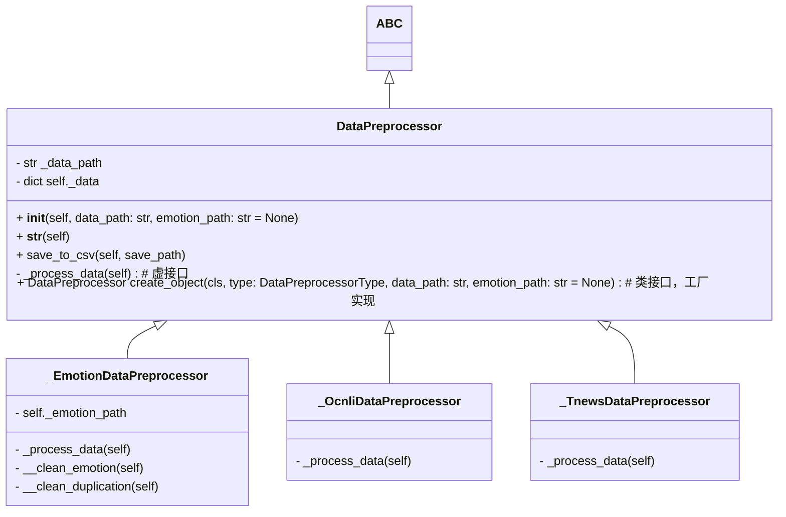
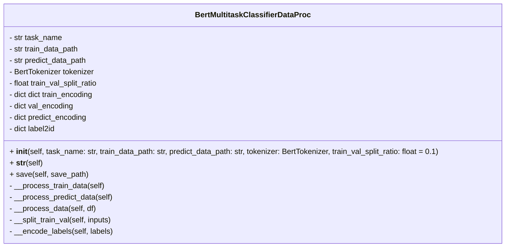

# 天池预训练模型泛化能力挑战赛——方案设计

优化方案：

1、增强数据，对数据进行预处理，参考Promot

2、优化模型结构进行微调；

## 1、数据预处理

对原始数据集进行预处理，对emotion数据集去除表情、去重处理、添加标签，对ocnli和tnews添加标签；

### 类图设计

**测试用例设计**

| 测试场景        | 输入数据                                                     | 期望输出                                     |
| --------------- | ------------------------------------------------------------ | -------------------------------------------- |
| 处理emotion数据 | OCEMOTION_a.csv OCEMOTION_b.csv OCEMOTION_train1128.csv | 输出处理后的数据文件，去除重复符号和表情符号 |
| 处理OCNLI数据   | OCNLI_a.csv OCNLI_b.csv OCNLI_train1128.csv        | 输出处理后的数据文件，去除重复符号           |
| 处理TNEWS数据   | TNEWS_a.csv TNEWS_b.csv TNEWS_train1128.csv        | 输出处理后的数据文件，去除重复符号           |
|                 |                                                              |                                              |

**测试用例设计**

| 测试场景                  | 输入数据                                           | 期望输出                                                     |
| ------------------------- | -------------------------------------------------- | ------------------------------------------------------------ |
| 向量化预处理后emotion数据 | OCEMOTION_train1128.csv OCEMOTION_a.csv  | 训练集向量化后划分为训练集和验证集，测试集向量化，输出pt文件 |
| 向量化预处理后OCNLI数据   | OCNLI_a.csv OCNLI_train1128.csv               | 训练集向量化后划分为训练集和验证集，测试集向量化，输出pt文件 |
| 向量化预处理后TNEWS数据   | TNEWS_a.csv TNEWS_train1128.csv               | 训练集向量化后划分为训练集和验证集，测试集向量化，输出pt文件 |

## 2、数据向量化

将输入训练数据划分为训练集和验证集，将test_a、test_b数据作为预测数据；

### 类图设计

## 2、BERT多任务微调模型

### 模型架构

